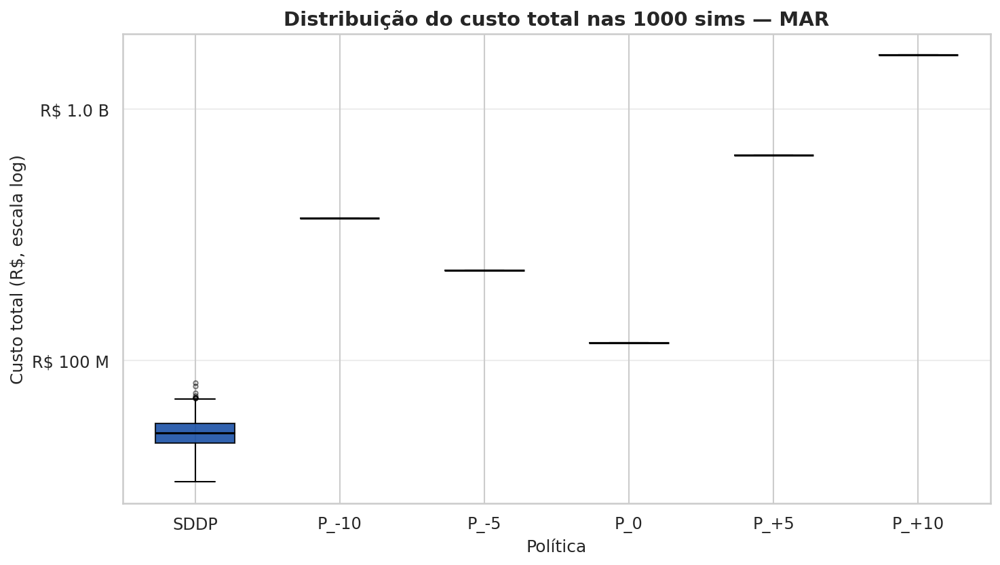
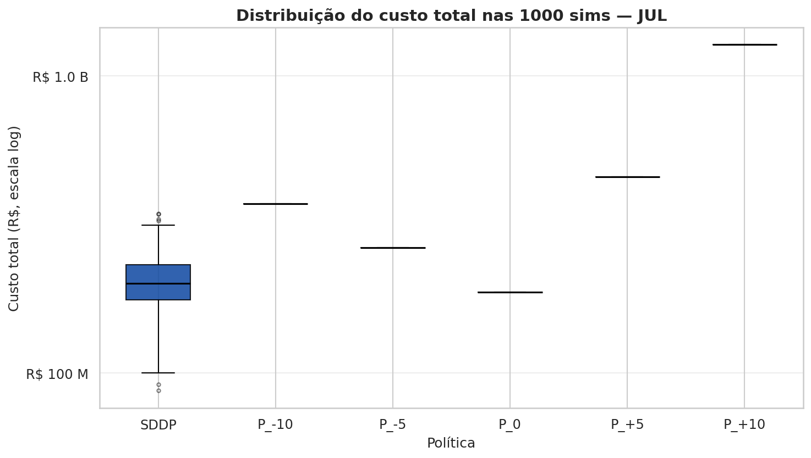
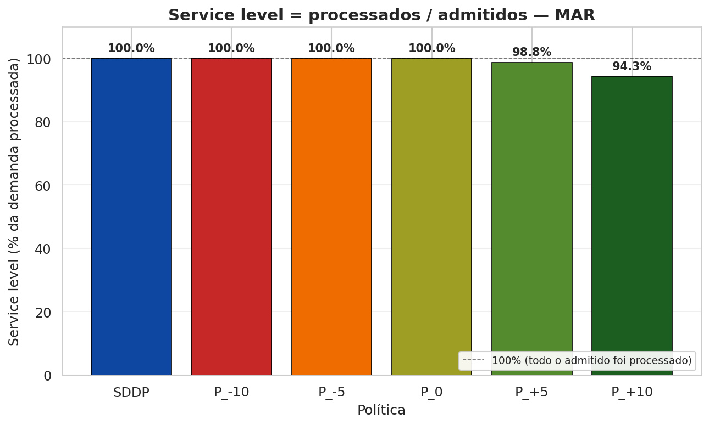
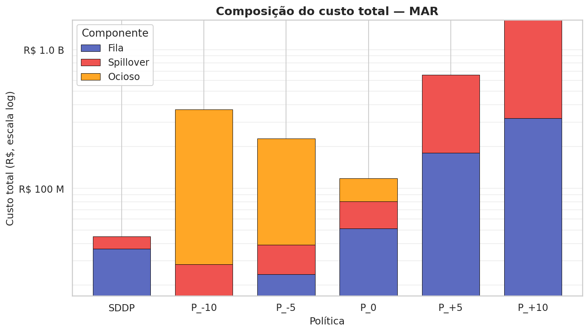
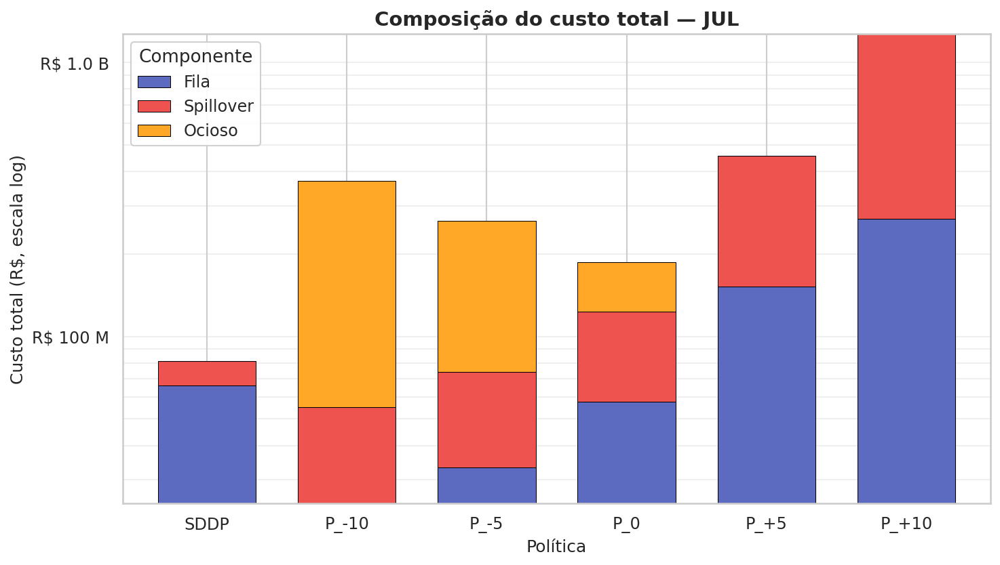
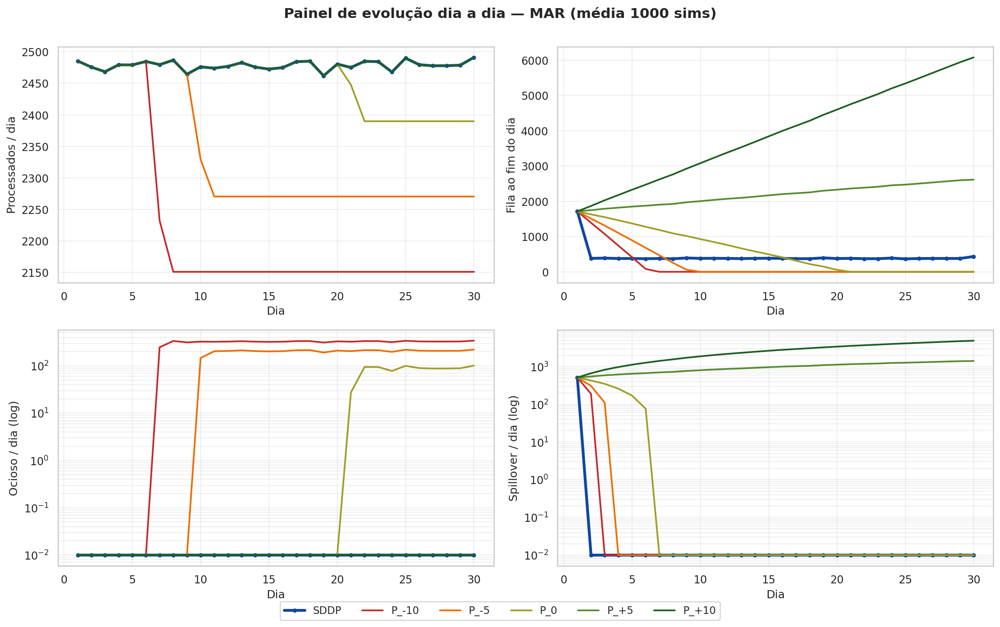
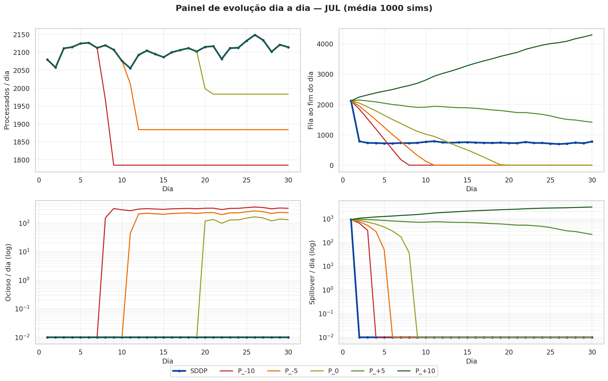
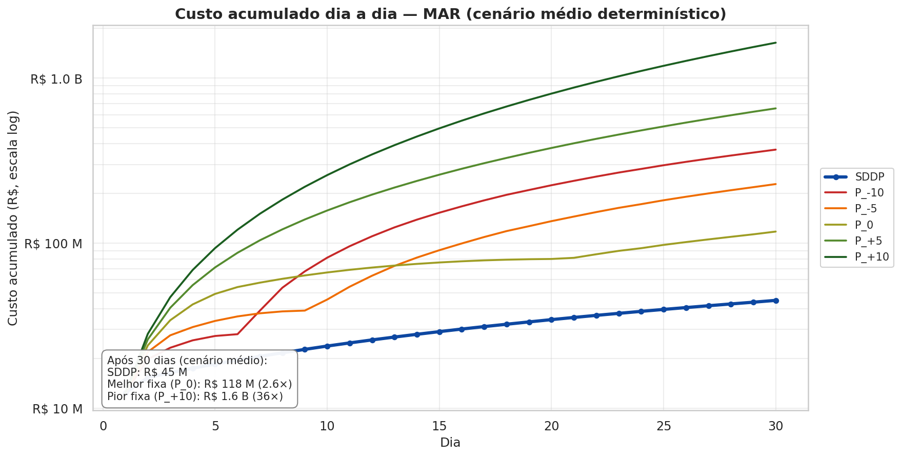
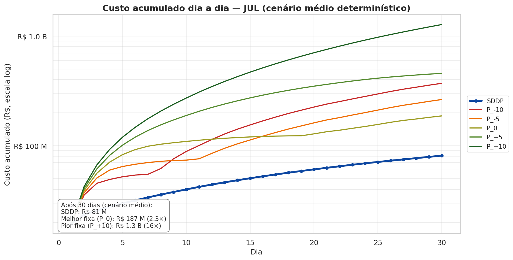
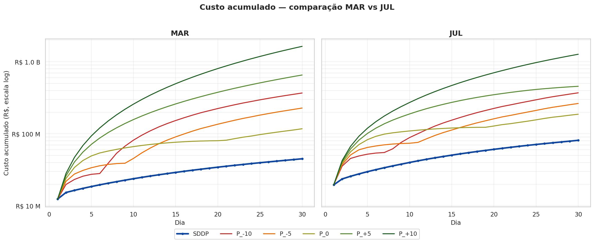

# Análise — SDDP vs Políticas Fixas de Admissão (v8.3)

**Pipeline:**
```
julia model_v8.jl        # exporta CSVs em outputs/
python plot_v8.py        # gera 15 PNGs
python gerar_analise.py  # gera este ANALISE.md a partir dos CSVs
```

Mês: Março (LogNormal, CV=10%) e Julho (Weibull, CV=36%). Horizonte de 30 dias. SDDP simulado com 1 000 amostragens estocásticas; fixas rodam **uma trajetória determinística** (w_proc fixo = média SDDP).

---

## 1. Modelo

### 1.1 Constantes

| Constante | Valor | Significado |
|-----------|------:|-------------|
| `CAP_ECOPATIO` | 1200 | Capacidade do pátio (gatilho de spillover) |
| `MAX_VAGAS` | 4000 | Limite máximo de admissão `admitidos.out ≤ MAX_VAGAS` |
| `C_FILA` | R$ 2 790 | Custo por caminhão-dia em fila |
| `C_SPILLOVER` | R$ 16 211 | Custo por caminhão fora do pátio (spillover) |
| `C_OCIOSO_TOTAL` | R$ 43 753 | Custo por unidade ociosa (= 1 753 op. + 42 000 receita perdida) |
| `FILA_INICIAL` | 1200 | Fila no dia 1 |
| `ADMITIDOS_INICIAL` | 3000 | Admissão obrigatória no dia 1 |
| `NUM_DIAS` | 30 | Horizonte (dias) |

### 1.2 Variáveis

| Variável | Tipo | Descrição |
|----------|------|-----------|
| `fila[t]` | estado, ≥ 0 | Caminhões em fila no início do dia `t` |
| `admitidos[t]` | estado, [0, 4000] | Caminhões admitidos para o próximo dia |
| `processados[t]` | decisão, ≥ 0 | Caminhões processados no dia |
| `spillover[t]` | decisão, ≥ 0 | Caminhões fora do pátio |
| `ocioso[t]` | decisão, ≥ 0 | Capacidade não utilizada |
| `w_proc[t]` | aleatório | Capacidade aleatória de processamento (estocástico) |

### 1.3 Restrições (∀ t = 1..30)

```
processados[t]    ≤ w_proc[t]
processados[t]    ≤ fila.in[t] + admitidos.in[t]
fila.out[t]       = fila.in[t] + admitidos.in[t] − processados[t]
spillover[t]      ≥ fila.in[t] + admitidos.in[t] − 1200 − processados[t]
ocioso[t]         ≥ w_proc[t] − processados[t]
0 ≤ admitidos[t] ≤ 4000

# Equivalência útil (decorre do balanço): spillover[t] = max(0, fila.out[t] − 1200)
```

### 1.4 Função objetivo (minimização)

```
min  Σ_{t=1..30}  [
        2790     · (fila.in[t] + fila.out[t]) / 2     # custo de fila (regra trapézio)
      + 16211   · spillover[t]                       # custo de spillover
      + 43753   · ocioso[t]                          # custo de ociosidade
     ]
```

---

## 2. Políticas avaliadas (pseudo-código)

### 2.1 SDDP — política dinâmica (referência)

```
Treinamento (offline):
  treinar SDDP com 200 iterações, lower_bound=0, optimizer=HiGHS
  w_proc parametrizado por discretização de quantis (100 pontos) da dist. ajustada

Execução (online, em cada estágio t):
  observa (fila.in[t], admitidos.in[t], w_proc[t])
  decide (processados[t], admitidos.out[t]) minimizando custo
    esperado dos estágios restantes via cortes de Benders
```

### 2.2 Políticas fixas P_X (5 níveis em ±10%, ±5%, 0% da base SDDP)

> **Importante:** as fixas **NÃO são Monte Carlo**. Como `w_proc[t]` é fixado (média do SDDP) e `adm_out = X` é constante, **toda a trajetória é determinística**: dado o estado inicial, há **uma única evolução possível** dos 30 dias. Não há amostragem aleatória nas fixas.

```
base = mean(admitidos.out do SDDP, dias 2..30 das 1 000 sims)
X_{P_-10}, X_{P_-5}, X_{P_0}, X_{P_+5}, X_{P_+10}
    = base × [0.90, 0.95, 1.00, 1.05, 1.10]

Estado inicial: fila = 1200,  admitidos.in = 3000

Para cada t = 1..30:
    w_proc[t] = mean(w_proc(SDDP) dia t, das 1 000 sims)  ← FIXO (não amostrado)
    processados[t]  = min(w_proc[t], fila.in + admitidos.in)
    spillover[t]    = max(0, fila.in + admitidos.in − 1200 − processados[t])
    ocioso[t]       = max(0, w_proc[t] − processados[t])
    fila.out        = fila.in + admitidos.in − processados[t]
    admitidos.out   = X    ← REGRA FIXA (constante por toda a simulação)
    fila.in, admitidos.in = fila.out, admitidos.out
```

> **Por que essa abordagem?** Para isolar o efeito da decisão de admissão. Tudo fica idêntico entre as 6 políticas (estado inicial, w_proc, fórmulas) — só muda `adm_out`. Diferenças no custo refletem APENAS a escolha de admissão. É uma comparação determinística, sem ruído estatístico.

---

## 3. Cenário de comparação (Anexos A/B)

Todas as 6 políticas rodam no **MESMO cenário médio determinístico**:

- `w_proc[t]` fixo = média das 1 000 sims SDDP por dia (mesma série em todas)
- Estado inicial idêntico (Fila=1200, AdmIn=3000)
- **SDDP** roda via `SDDP.Historical` com `w_proc[t]` forçado
- **Fixas** rodam **uma trajetória determinística** com `adm_out = X` constante (não há amostragem — sem aleatoriedade)

**Resultado:** `Spill[t] = max(0, FilaFim[t] − 1 200)` bate **exato linha a linha em todas as 6 políticas** (validado: 12/12 OK). Comparação 100% justa.

**Consistência (v8.4):** o **gráfico de custo acumulado** (`py_v8_<mes>_custo_acumulado.png`) usa o **mesmo cenário médio determinístico** dos Anexos A/B. Os totais ao final do dia 30 batem **exato** com a coluna Σ Custo das tabelas — sem ambiguidade.

Para estatísticas agregadas das 1 000 sims estocásticas do SDDP (custo médio com IC, quantis, P(spill>0)), ver §5 (Indicadores).

---

## 4. Dados e distribuições

| Mês | Média (cam/dia) | sd | CV | Dist | AIC | KS p-value |
|-----|----------------:|---:|---:|------|----:|-----------:|
| mar | 2 480.2 | 251.3 | 0.10 | **LogNormal** | 417.5 | 0.55 |
| jul | 2 102.1 | 754.6 | 0.36 | **Weibull** | 484.8 | 0.93 |

Critério: menor AIC entre os modelos com KS p ≥ 0.05. Ajuste em `outputs/v8_<mes>_fit_*.png`.

**Bases X (média de adm_out SDDP nos dias 2..30):**

| Mês | base | X(P_-10) | X(P_-5) | X(P_0) | X(P_+5) | X(P_+10) |
|-----|-----:|---------:|--------:|-------:|--------:|---------:|
| MAR | 2 395 | 2 155 | 2 275 | 2 395 | 2 515 | 2 634 |
| JUL | 2 035 | 1 832 | 1 934 | 2 035 | 2 137 | 2 239 |

---

## 5. Indicadores

### 5.1 Glossário

| Indicador | Definição |
|-----------|-----------|
| **Custo médio** | Esperança do custo total dos 30 dias (média 1 000 sims) |
| **IC 95%** | Intervalo de confiança 95% do custo médio (`± 1.96·sd/√N`) |
| **P5 / P50 / P95** | Quantis 5%, 50% (mediana), 95% da distribuição do custo |
| **P(spill > 0)** | Probabilidade de haver spillover em algum dia |
| **Spill cond.** | Spillover total esperado **condicional** a ter ocorrido |
| **Fila pico** | Média do pico de fila ao longo dos 30 dias (limite MAX_VAGAS=4000) |
| **Service level** | Σ proc / Σ admitidos nos dias 2..30, cap em 100% |
| **entram/proc/ocio/spill/dia** | Médias diárias das 4 quantidades operacionais |

### 5.2 MAR — valores

| Indicador | SDDP | P_-10 | P_-5 | P_0 | P_+5 | P_+10 |
|-----------|-----:|------:|-----:|----:|-----:|------:|
| Custo médio | R$ 51.8 M | R$ 368.7 M | R$ 228.0 M | R$ 117.5 M | R$ 655.4 M | R$ 1.64 B |
| IC 95% | ± 0.45 M | ± 0.00 M | ± 0.00 M | ± 0.00 M | ± 0.00 M | ± 0.00 M |
| P5 (custo) | R$ 40.3 M | R$ 368.7 M | R$ 228.0 M | R$ 117.5 M | R$ 655.4 M | R$ 1.64 B |
| P50 (custo) | R$ 51.3 M | R$ 368.7 M | R$ 228.0 M | R$ 117.5 M | R$ 655.4 M | R$ 1.64 B |
| P95 (custo) | R$ 64.5 M | R$ 368.7 M | R$ 228.0 M | R$ 117.5 M | R$ 655.4 M | R$ 1.64 B |
| P(spill > 0) | 98.5% | 100.0% | 100.0% | 100.0% | 100.0% | 100.0% |
| Spill cond. | 523 | 704 | 935 | 1 801 | 29 312 | 81 292 |
| Fila pico | 1 714 | 1 714 | 1 714 | 1 714 | 2 614 | 6 079 |
| Service level | 100.0% | 100.0% | 100.0% | 100.0% | 98.8% | 94.3% |
| entram/dia | 2 448 | 2 179 | 2 295 | 2 410 | 2 526 | 2 641 |
| proc/dia | 2 474 | 2 219 | 2 335 | 2 450 | 2 479 | 2 479 |
| ocio/dia | 5 | 259 | 144 | 28 | 0 | 0 |
| spill/dia | 17 | 23 | 31 | 60 | 977 | 2 710 |

**Melhor fixa MAR:** P_0 = R$ 117.5 M (2.27× SDDP). **Pior:** P_+10 = R$ 1.64 B (32× SDDP).

### 5.3 JUL — valores

| Indicador | SDDP | P_-10 | P_-5 | P_0 | P_+5 | P_+10 |
|-----------|-----:|------:|-----:|----:|-----:|------:|
| Custo médio | R$ 203.6 M | R$ 370.7 M | R$ 263.8 M | R$ 187.1 M | R$ 456.8 M | R$ 1.27 B |
| IC 95% | ± 2.55 M | ± 0.00 M | ± 0.00 M | ± 0.00 M | ± 0.00 M | ± 0.00 M |
| P5 (custo) | R$ 139.6 M | R$ 370.7 M | R$ 263.8 M | R$ 187.1 M | R$ 456.8 M | R$ 1.27 B |
| P50 (custo) | R$ 200.2 M | R$ 370.7 M | R$ 263.8 M | R$ 187.1 M | R$ 456.8 M | R$ 1.27 B |
| P95 (custo) | R$ 270.5 M | R$ 370.7 M | R$ 263.8 M | R$ 187.1 M | R$ 456.8 M | R$ 1.27 B |
| P(spill > 0) | 100.0% | 100.0% | 100.0% | 100.0% | 100.0% | 100.0% |
| Spill cond. | 4 105 | 1 889 | 2 524 | 4 027 | 18 773 | 61 906 |
| Fila pico | 2 370 | 2 120 | 2 120 | 2 120 | 2 145 | 4 292 |
| Service level | 100.0% | 100.0% | 100.0% | 100.0% | 100.0% | 96.6% |
| entram/dia | 2 043 | 1 825 | 1 921 | 2 017 | 2 113 | 2 209 |
| proc/dia | 2 055 | 1 865 | 1 961 | 2 057 | 2 106 | 2 106 |
| ocio/dia | 51 | 240 | 144 | 49 | 0 | 0 |
| spill/dia | 137 | 63 | 84 | 134 | 626 | 2 064 |

**Achado contraintuitivo JUL:** P_0 = R$ 187.1 M **vence** o SDDP = R$ 203.6 M (0.92×). Razão: P_0 opera no cenário médio determinístico (w_proc fixo); o SDDP é simulado com w_proc estocástico real (Weibull com sd=754) — paga o custo da variabilidade.

---

## 6. Gráficos

Cada gráfico abaixo é gerado por `plot_v8.py` a partir dos CSVs. Todos em `outputs/`.

### 6.1 Boxplot custo total (1 000 sims, log)
Mostra distribuição do custo total entre as 1 000 réplicas. Fixas viram linha (determinísticas no cenário médio).





### 6.2 Service level por política
Fração da demanda admitida que é de fato processada nos dias 2..30 (cap 100%).




### 6.3 Composição do custo
Decompõe o custo total em fila + spillover + ociosidade (escala log).





### 6.4 Painel 4 variáveis (proc / fila / ocio log / spill log)
Evolução diária de 4 quantidades-chave por política.





### 6.5 Custo acumulado (log)
Soma cumulativa do custo dia a dia — "o gráfico do dinheiro".





### 6.6 Comparativo mar vs jul (side-by-side)



---

## Anexo A — MAR: cenário médio (6 políticas, 30 dias)

Todas as 6 políticas no mesmo cenário (w_proc = média 1 000 sims SDDP). Valores nativos do modelo — `Spill = max(0, FilaFim − 1 200)` bate exato.

### MAR — `SDDP` — SDDP via `SDDP.Historical` (1 trajetória no cenário médio)

| Dia | FilaIni | AdmIn | w_proc | Proc | FilaFim | Spill | Ocioso | AdmOut | Custo |
|----:|--------:|------:|-------:|-----:|--------:|------:|-------:|-------:|------:|
| 1 | 1200 | 3000 | 2486 | 2486 | 1714 | 514.5 | 0.0 | 1143 | 12.41M |
| 2 | 1714 | 1143 | 2476 | 2476 | 381.2 | 0.0 | -0.0 | 2476 | 2.92M |
| 3 | 381.2 | 2476 | 2468 | 2468 | 388.5 | 0.0 | 0.0 | 2468 | 1.07M |
| 4 | 388.5 | 2468 | 2479 | 2479 | 377.6 | 0.0 | 0.0 | 2479 | 1.07M |
| 5 | 377.6 | 2479 | 2479 | 2479 | 377.8 | 0.0 | 0.0 | 2479 | 1.05M |
| 6 | 377.8 | 2479 | 2485 | 2485 | 372.3 | 0.0 | -0.0 | 2485 | 1.05M |
| 7 | 372.3 | 2485 | 2480 | 2480 | 377.3 | 0.0 | -0.0 | 2480 | 1.05M |
| 8 | 377.3 | 2480 | 2487 | 2487 | 370.2 | 0.0 | -0.0 | 2487 | 1.04M |
| 9 | 370.2 | 2487 | 2465 | 2465 | 392.4 | 0.0 | -0.0 | 2465 | 1.06M |
| 10 | 392.4 | 2465 | 2476 | 2476 | 380.8 | 0.0 | 0.0 | 2476 | 1.08M |
| 11 | 380.8 | 2476 | 2474 | 2474 | 382.9 | 0.0 | -0.0 | 2474 | 1.07M |
| 12 | 382.9 | 2474 | 2477 | 2477 | 380.0 | 0.0 | -0.0 | 2477 | 1.06M |
| 13 | 380.0 | 2477 | 2483 | 2483 | 374.1 | 0.0 | 0.0 | 2483 | 1.05M |
| 14 | 374.1 | 2483 | 2476 | 2476 | 381.3 | 0.0 | -0.0 | 2476 | 1.05M |
| 15 | 381.3 | 2476 | 2473 | 2473 | 384.3 | 0.0 | -0.0 | 2473 | 1.07M |
| 16 | 384.3 | 2473 | 2475 | 2475 | 382.1 | 0.0 | -0.0 | 2475 | 1.07M |
| 17 | 382.1 | 2475 | 2484 | 2484 | 372.7 | 0.0 | 0.0 | 2484 | 1.05M |
| 18 | 372.7 | 2484 | 2485 | 2485 | 371.8 | 0.0 | -0.0 | 2485 | 1.04M |
| 19 | 371.8 | 2485 | 2462 | 2462 | 394.9 | 0.0 | -0.0 | 2462 | 1.07M |
| 20 | 394.9 | 2462 | 2481 | 2481 | 376.4 | 0.0 | -0.0 | 2481 | 1.08M |
| 21 | 376.4 | 2481 | 2475 | 2475 | 381.8 | 0.0 | 0.0 | 2475 | 1.06M |
| 22 | 381.8 | 2475 | 2485 | 2485 | 372.0 | 0.0 | -0.0 | 2485 | 1.05M |
| 23 | 372.0 | 2485 | 2484 | 2484 | 372.6 | 0.0 | -0.0 | 2484 | 1.04M |
| 24 | 372.6 | 2484 | 2468 | 2468 | 389.0 | 0.0 | -0.0 | 2468 | 1.06M |
| 25 | 389.0 | 2468 | 2490 | 2490 | 366.9 | 0.0 | -0.0 | 2490 | 1.05M |
| 26 | 366.9 | 2490 | 2480 | 2480 | 377.4 | 0.0 | 0.0 | 2480 | 1.04M |
| 27 | 377.4 | 2480 | 2478 | 2478 | 379.1 | 0.0 | 0.0 | 2478 | 1.06M |
| 28 | 379.1 | 2478 | 2478 | 2478 | 379.0 | 0.0 | 0.0 | 2478 | 1.06M |
| 29 | 379.0 | 2478 | 2479 | 2479 | 378.1 | 0.0 | 0.0 | 2547 | 1.06M |
| 30 | 378.1 | 2547 | 2491 | 2491 | 433.8 | 0.0 | 0.0 | 0.0 | 1.13M |
| **Σ** | — | — | — | **74358** | — | **514.5** | **0.0** | — | **45.02M** |

### MAR — `P_-10` — Simulação determinística (1 trajetória, `adm_out` fixo)

| Dia | FilaIni | AdmIn | w_proc | Proc | FilaFim | Spill | Ocioso | AdmOut | Custo |
|----:|--------:|------:|-------:|-----:|--------:|------:|-------:|-------:|------:|
| 1 | 1200 | 3000 | 2486 | 2486 | 1714 | 514.5 | 0.0 | 2151 | 12.41M |
| 2 | 1714 | 2151 | 2476 | 2476 | 1390 | 189.6 | 0.0 | 2151 | 7.40M |
| 3 | 1390 | 2151 | 2468 | 2468 | 1072 | 0.0 | 0.0 | 2151 | 3.43M |
| 4 | 1072 | 2151 | 2479 | 2479 | 743.5 | 0.0 | 0.0 | 2151 | 2.53M |
| 5 | 743.5 | 2151 | 2479 | 2479 | 415.1 | 0.0 | 0.0 | 2151 | 1.62M |
| 6 | 415.1 | 2151 | 2485 | 2485 | 81.3 | 0.0 | 0.0 | 2151 | 692591 |
| 7 | 81.3 | 2151 | 2480 | 2232 | 0.0 | 0.0 | 247.5 | 2151 | 10.94M |
| 8 | 0.0 | 2151 | 2487 | 2151 | 0.0 | 0.0 | 335.9 | 2151 | 14.70M |
| 9 | 0.0 | 2151 | 2465 | 2151 | 0.0 | 0.0 | 313.7 | 2151 | 13.72M |
| 10 | 0.0 | 2151 | 2476 | 2151 | 0.0 | 0.0 | 325.3 | 2151 | 14.23M |
| 11 | 0.0 | 2151 | 2474 | 2151 | 0.0 | 0.0 | 323.2 | 2151 | 14.14M |
| 12 | 0.0 | 2151 | 2477 | 2151 | 0.0 | 0.0 | 326.1 | 2151 | 14.27M |
| 13 | 0.0 | 2151 | 2483 | 2151 | 0.0 | 0.0 | 332.0 | 2151 | 14.53M |
| 14 | 0.0 | 2151 | 2476 | 2151 | 0.0 | 0.0 | 324.8 | 2151 | 14.21M |
| 15 | 0.0 | 2151 | 2473 | 2151 | 0.0 | 0.0 | 321.8 | 2151 | 14.08M |
| 16 | 0.0 | 2151 | 2475 | 2151 | 0.0 | 0.0 | 324.1 | 2151 | 14.18M |
| 17 | 0.0 | 2151 | 2484 | 2151 | 0.0 | 0.0 | 333.4 | 2151 | 14.59M |
| 18 | 0.0 | 2151 | 2485 | 2151 | 0.0 | 0.0 | 334.3 | 2151 | 14.63M |
| 19 | 0.0 | 2151 | 2462 | 2151 | 0.0 | 0.0 | 311.2 | 2151 | 13.62M |
| 20 | 0.0 | 2151 | 2481 | 2151 | 0.0 | 0.0 | 329.7 | 2151 | 14.42M |
| 21 | 0.0 | 2151 | 2475 | 2151 | 0.0 | 0.0 | 324.3 | 2151 | 14.19M |
| 22 | 0.0 | 2151 | 2485 | 2151 | 0.0 | 0.0 | 334.1 | 2151 | 14.62M |
| 23 | 0.0 | 2151 | 2484 | 2151 | 0.0 | 0.0 | 333.5 | 2151 | 14.59M |
| 24 | 0.0 | 2151 | 2468 | 2151 | 0.0 | 0.0 | 317.1 | 2151 | 13.87M |
| 25 | 0.0 | 2151 | 2490 | 2151 | 0.0 | 0.0 | 339.2 | 2151 | 14.84M |
| 26 | 0.0 | 2151 | 2480 | 2151 | 0.0 | 0.0 | 328.7 | 2151 | 14.38M |
| 27 | 0.0 | 2151 | 2478 | 2151 | 0.0 | 0.0 | 327.0 | 2151 | 14.31M |
| 28 | 0.0 | 2151 | 2478 | 2151 | 0.0 | 0.0 | 327.1 | 2151 | 14.31M |
| 29 | 0.0 | 2151 | 2479 | 2151 | 0.0 | 0.0 | 328.0 | 2151 | 14.35M |
| 30 | 0.0 | 2151 | 2491 | 2151 | 0.0 | 0.0 | 340.3 | 2151 | 14.89M |
| **Σ** | — | — | — | **66576** | — | **704.1** | **7782** | — | **368.70M** |

### MAR — `P_-5` — Simulação determinística (1 trajetória, `adm_out` fixo)

| Dia | FilaIni | AdmIn | w_proc | Proc | FilaFim | Spill | Ocioso | AdmOut | Custo |
|----:|--------:|------:|-------:|-----:|--------:|------:|-------:|-------:|------:|
| 1 | 1200 | 3000 | 2486 | 2486 | 1714 | 514.5 | 0.0 | 2270 | 12.41M |
| 2 | 1714 | 2270 | 2476 | 2476 | 1509 | 309.1 | 0.0 | 2270 | 9.51M |
| 3 | 1509 | 2270 | 2468 | 2468 | 1311 | 111.0 | 0.0 | 2270 | 5.73M |
| 4 | 1311 | 2270 | 2479 | 2479 | 1102 | 0.0 | 0.0 | 2270 | 3.37M |
| 5 | 1102 | 2270 | 2479 | 2479 | 893.1 | 0.0 | 0.0 | 2270 | 2.78M |
| 6 | 893.1 | 2270 | 2485 | 2485 | 678.8 | 0.0 | 0.0 | 2270 | 2.19M |
| 7 | 678.8 | 2270 | 2480 | 2480 | 469.5 | 0.0 | 0.0 | 2270 | 1.60M |
| 8 | 469.5 | 2270 | 2487 | 2487 | 253.0 | 0.0 | 0.0 | 2270 | 1.01M |
| 9 | 253.0 | 2270 | 2465 | 2465 | 58.9 | 0.0 | 0.0 | 2270 | 435105 |
| 10 | 58.9 | 2270 | 2476 | 2329 | 0.0 | 0.0 | 147.0 | 2270 | 6.51M |
| 11 | 0.0 | 2270 | 2474 | 2270 | 0.0 | 0.0 | 203.7 | 2270 | 8.91M |
| 12 | 0.0 | 2270 | 2477 | 2270 | 0.0 | 0.0 | 206.6 | 2270 | 9.04M |
| 13 | 0.0 | 2270 | 2483 | 2270 | 0.0 | 0.0 | 212.5 | 2270 | 9.30M |
| 14 | 0.0 | 2270 | 2476 | 2270 | 0.0 | 0.0 | 205.3 | 2270 | 8.98M |
| 15 | 0.0 | 2270 | 2473 | 2270 | 0.0 | 0.0 | 202.3 | 2270 | 8.85M |
| 16 | 0.0 | 2270 | 2475 | 2270 | 0.0 | 0.0 | 204.6 | 2270 | 8.95M |
| 17 | 0.0 | 2270 | 2484 | 2270 | 0.0 | 0.0 | 213.9 | 2270 | 9.36M |
| 18 | 0.0 | 2270 | 2485 | 2270 | 0.0 | 0.0 | 214.8 | 2270 | 9.40M |
| 19 | 0.0 | 2270 | 2462 | 2270 | 0.0 | 0.0 | 191.7 | 2270 | 8.39M |
| 20 | 0.0 | 2270 | 2481 | 2270 | 0.0 | 0.0 | 210.2 | 2270 | 9.20M |
| 21 | 0.0 | 2270 | 2475 | 2270 | 0.0 | 0.0 | 204.8 | 2270 | 8.96M |
| 22 | 0.0 | 2270 | 2485 | 2270 | 0.0 | 0.0 | 214.6 | 2270 | 9.39M |
| 23 | 0.0 | 2270 | 2484 | 2270 | 0.0 | 0.0 | 214.0 | 2270 | 9.37M |
| 24 | 0.0 | 2270 | 2468 | 2270 | 0.0 | 0.0 | 197.6 | 2270 | 8.65M |
| 25 | 0.0 | 2270 | 2490 | 2270 | 0.0 | 0.0 | 219.7 | 2270 | 9.61M |
| 26 | 0.0 | 2270 | 2480 | 2270 | 0.0 | 0.0 | 209.2 | 2270 | 9.15M |
| 27 | 0.0 | 2270 | 2478 | 2270 | 0.0 | 0.0 | 207.5 | 2270 | 9.08M |
| 28 | 0.0 | 2270 | 2478 | 2270 | 0.0 | 0.0 | 207.6 | 2270 | 9.08M |
| 29 | 0.0 | 2270 | 2479 | 2270 | 0.0 | 0.0 | 208.5 | 2270 | 9.12M |
| 30 | 0.0 | 2270 | 2491 | 2270 | 0.0 | 0.0 | 220.8 | 2270 | 9.66M |
| **Σ** | — | — | — | **70041** | — | **934.5** | **4317** | — | **228.00M** |

### MAR — `P_0` — Simulação determinística (1 trajetória, `adm_out` fixo)

| Dia | FilaIni | AdmIn | w_proc | Proc | FilaFim | Spill | Ocioso | AdmOut | Custo |
|----:|--------:|------:|-------:|-----:|--------:|------:|-------:|-------:|------:|
| 1 | 1200 | 3000 | 2486 | 2486 | 1714 | 514.5 | 0.0 | 2390 | 12.41M |
| 2 | 1714 | 2390 | 2476 | 2476 | 1629 | 428.6 | 0.0 | 2390 | 11.61M |
| 3 | 1629 | 2390 | 2468 | 2468 | 1550 | 349.9 | 0.0 | 2390 | 10.11M |
| 4 | 1550 | 2390 | 2479 | 2479 | 1460 | 260.4 | 0.0 | 2390 | 8.42M |
| 5 | 1460 | 2390 | 2479 | 2479 | 1371 | 171.1 | 0.0 | 2390 | 6.72M |
| 6 | 1371 | 2390 | 2485 | 2485 | 1276 | 76.3 | 0.0 | 2390 | 4.93M |
| 7 | 1276 | 2390 | 2480 | 2480 | 1186 | 0.0 | 0.0 | 2390 | 3.44M |
| 8 | 1186 | 2390 | 2487 | 2487 | 1090 | 0.0 | 0.0 | 2390 | 3.17M |
| 9 | 1090 | 2390 | 2465 | 2465 | 1015 | 0.0 | 0.0 | 2390 | 2.94M |
| 10 | 1015 | 2390 | 2476 | 2476 | 928.5 | 0.0 | 0.0 | 2390 | 2.71M |
| 11 | 928.5 | 2390 | 2474 | 2474 | 844.3 | 0.0 | 0.0 | 2390 | 2.47M |
| 12 | 844.3 | 2390 | 2477 | 2477 | 757.2 | 0.0 | 0.0 | 2390 | 2.23M |
| 13 | 757.2 | 2390 | 2483 | 2483 | 664.2 | 0.0 | 0.0 | 2390 | 1.98M |
| 14 | 664.2 | 2390 | 2476 | 2476 | 578.3 | 0.0 | 0.0 | 2390 | 1.73M |
| 15 | 578.3 | 2390 | 2473 | 2473 | 495.5 | 0.0 | 0.0 | 2390 | 1.50M |
| 16 | 495.5 | 2390 | 2475 | 2475 | 410.5 | 0.0 | 0.0 | 2390 | 1.26M |
| 17 | 410.5 | 2390 | 2484 | 2484 | 316.0 | 0.0 | 0.0 | 2390 | 1.01M |
| 18 | 316.0 | 2390 | 2485 | 2485 | 220.7 | 0.0 | 0.0 | 2390 | 748707 |
| 19 | 220.7 | 2390 | 2462 | 2462 | 148.5 | 0.0 | 0.0 | 2390 | 514971 |
| 20 | 148.5 | 2390 | 2481 | 2481 | 57.8 | 0.0 | 0.0 | 2390 | 287713 |
| 21 | 57.8 | 2390 | 2475 | 2448 | 0.0 | 0.0 | 27.6 | 2390 | 1.29M |
| 22 | 0.0 | 2390 | 2485 | 2390 | 0.0 | 0.0 | 95.1 | 2390 | 4.16M |
| 23 | 0.0 | 2390 | 2484 | 2390 | 0.0 | 0.0 | 94.5 | 2390 | 4.14M |
| 24 | 0.0 | 2390 | 2468 | 2390 | 0.0 | 0.0 | 78.1 | 2390 | 3.42M |
| 25 | 0.0 | 2390 | 2490 | 2390 | 0.0 | 0.0 | 100.2 | 2390 | 4.38M |
| 26 | 0.0 | 2390 | 2480 | 2390 | 0.0 | 0.0 | 89.7 | 2390 | 3.92M |
| 27 | 0.0 | 2390 | 2478 | 2390 | 0.0 | 0.0 | 88.1 | 2390 | 3.85M |
| 28 | 0.0 | 2390 | 2478 | 2390 | 0.0 | 0.0 | 88.1 | 2390 | 3.86M |
| 29 | 0.0 | 2390 | 2479 | 2390 | 0.0 | 0.0 | 89.0 | 2390 | 3.89M |
| 30 | 0.0 | 2390 | 2491 | 2390 | 0.0 | 0.0 | 101.3 | 2390 | 4.43M |
| **Σ** | — | — | — | **73506** | — | **1801** | **851.7** | — | **117.55M** |

### MAR — `P_+5` — Simulação determinística (1 trajetória, `adm_out` fixo)

| Dia | FilaIni | AdmIn | w_proc | Proc | FilaFim | Spill | Ocioso | AdmOut | Custo |
|----:|--------:|------:|-------:|-----:|--------:|------:|-------:|-------:|------:|
| 1 | 1200 | 3000 | 2486 | 2486 | 1714 | 514.5 | 0.0 | 2509 | 12.41M |
| 2 | 1714 | 2509 | 2476 | 2476 | 1748 | 548.1 | 0.0 | 2509 | 13.71M |
| 3 | 1748 | 2509 | 2468 | 2468 | 1789 | 588.9 | 0.0 | 2509 | 14.48M |
| 4 | 1789 | 2509 | 2479 | 2479 | 1819 | 618.9 | 0.0 | 2509 | 15.07M |
| 5 | 1819 | 2509 | 2479 | 2479 | 1849 | 649.1 | 0.0 | 2509 | 15.64M |
| 6 | 1849 | 2509 | 2485 | 2485 | 1874 | 673.8 | 0.0 | 2509 | 16.12M |
| 7 | 1874 | 2509 | 2480 | 2480 | 1903 | 703.4 | 0.0 | 2509 | 16.67M |
| 8 | 1903 | 2509 | 2487 | 2487 | 1926 | 726.0 | 0.0 | 2509 | 17.11M |
| 9 | 1926 | 2509 | 2465 | 2465 | 1971 | 770.8 | 0.0 | 2509 | 17.93M |
| 10 | 1971 | 2509 | 2476 | 2476 | 2004 | 803.9 | 0.0 | 2509 | 18.58M |
| 11 | 2004 | 2509 | 2474 | 2474 | 2039 | 839.2 | 0.0 | 2509 | 19.24M |
| 12 | 2039 | 2509 | 2477 | 2477 | 2072 | 871.6 | 0.0 | 2509 | 19.86M |
| 13 | 2072 | 2509 | 2483 | 2483 | 2098 | 898.1 | 0.0 | 2509 | 20.38M |
| 14 | 2098 | 2509 | 2476 | 2476 | 2132 | 931.8 | 0.0 | 2509 | 21.01M |
| 15 | 2132 | 2509 | 2473 | 2473 | 2168 | 968.5 | 0.0 | 2509 | 21.70M |
| 16 | 2168 | 2509 | 2475 | 2475 | 2203 | 1003 | 0.0 | 2509 | 22.36M |
| 17 | 2203 | 2509 | 2484 | 2484 | 2228 | 1028 | 0.0 | 2509 | 22.84M |
| 18 | 2228 | 2509 | 2485 | 2485 | 2252 | 1052 | 0.0 | 2509 | 23.30M |
| 19 | 2252 | 2509 | 2462 | 2462 | 2299 | 1099 | 0.0 | 2509 | 24.17M |
| 20 | 2299 | 2509 | 2481 | 2481 | 2328 | 1128 | 0.0 | 2509 | 24.74M |
| 21 | 2328 | 2509 | 2475 | 2475 | 2362 | 1162 | 0.0 | 2509 | 25.39M |
| 22 | 2362 | 2509 | 2485 | 2485 | 2387 | 1187 | 0.0 | 2509 | 25.86M |
| 23 | 2387 | 2509 | 2484 | 2484 | 2412 | 1212 | 0.0 | 2509 | 26.34M |
| 24 | 2412 | 2509 | 2468 | 2468 | 2453 | 1253 | 0.0 | 2509 | 27.10M |
| 25 | 2453 | 2509 | 2490 | 2490 | 2472 | 1272 | 0.0 | 2509 | 27.50M |
| 26 | 2472 | 2509 | 2480 | 2480 | 2502 | 1302 | 0.0 | 2509 | 28.05M |
| 27 | 2502 | 2509 | 2478 | 2478 | 2534 | 1334 | 0.0 | 2509 | 28.64M |
| 28 | 2534 | 2509 | 2478 | 2478 | 2565 | 1365 | 0.0 | 2509 | 29.24M |
| 29 | 2565 | 2509 | 2479 | 2479 | 2595 | 1395 | 0.0 | 2509 | 29.82M |
| 30 | 2595 | 2509 | 2491 | 2491 | 2614 | 1414 | 0.0 | 2509 | 30.18M |
| **Σ** | — | — | — | **74358** | — | **29312** | **0.0** | — | **655.43M** |

### MAR — `P_+10` — Simulação determinística (1 trajetória, `adm_out` fixo)

| Dia | FilaIni | AdmIn | w_proc | Proc | FilaFim | Spill | Ocioso | AdmOut | Custo |
|----:|--------:|------:|-------:|-----:|--------:|------:|-------:|-------:|------:|
| 1 | 1200 | 3000 | 2486 | 2486 | 1714 | 514.5 | 0.0 | 2629 | 12.41M |
| 2 | 1714 | 2629 | 2476 | 2476 | 1868 | 667.6 | 0.0 | 2629 | 15.82M |
| 3 | 1868 | 2629 | 2468 | 2468 | 2028 | 827.9 | 0.0 | 2629 | 18.86M |
| 4 | 2028 | 2629 | 2479 | 2479 | 2177 | 977.4 | 0.0 | 2629 | 21.71M |
| 5 | 2177 | 2629 | 2479 | 2479 | 2327 | 1127 | 0.0 | 2629 | 24.55M |
| 6 | 2327 | 2629 | 2485 | 2485 | 2471 | 1271 | 0.0 | 2629 | 27.30M |
| 7 | 2471 | 2629 | 2480 | 2480 | 2620 | 1420 | 0.0 | 2629 | 30.13M |
| 8 | 2620 | 2629 | 2487 | 2487 | 2762 | 1562 | 0.0 | 2629 | 32.84M |
| 9 | 2762 | 2629 | 2465 | 2465 | 2927 | 1727 | 0.0 | 2629 | 35.93M |
| 10 | 2927 | 2629 | 2476 | 2476 | 3079 | 1879 | 0.0 | 2629 | 38.84M |
| 11 | 3079 | 2629 | 2474 | 2474 | 3234 | 2034 | 0.0 | 2629 | 41.78M |
| 12 | 3234 | 2629 | 2477 | 2477 | 3386 | 2186 | 0.0 | 2629 | 44.67M |
| 13 | 3386 | 2629 | 2483 | 2483 | 3532 | 2332 | 0.0 | 2629 | 47.46M |
| 14 | 3532 | 2629 | 2476 | 2476 | 3685 | 2485 | 0.0 | 2629 | 50.36M |
| 15 | 3685 | 2629 | 2473 | 2473 | 3841 | 2641 | 0.0 | 2629 | 53.32M |
| 16 | 3841 | 2629 | 2475 | 2475 | 3995 | 2795 | 0.0 | 2629 | 56.25M |
| 17 | 3995 | 2629 | 2484 | 2484 | 4140 | 2940 | 0.0 | 2629 | 59.01M |
| 18 | 4140 | 2629 | 2485 | 2485 | 4283 | 3083 | 0.0 | 2629 | 61.74M |
| 19 | 4283 | 2629 | 2462 | 2462 | 4450 | 3250 | 0.0 | 2629 | 64.87M |
| 20 | 4450 | 2629 | 2481 | 2481 | 4599 | 3399 | 0.0 | 2629 | 67.72M |
| 21 | 4599 | 2629 | 2475 | 2475 | 4752 | 3552 | 0.0 | 2629 | 70.63M |
| 22 | 4752 | 2629 | 2485 | 2485 | 4896 | 3696 | 0.0 | 2629 | 73.38M |
| 23 | 4896 | 2629 | 2484 | 2484 | 5040 | 3840 | 0.0 | 2629 | 76.12M |
| 24 | 5040 | 2629 | 2468 | 2468 | 5201 | 4001 | 0.0 | 2629 | 79.15M |
| 25 | 5201 | 2629 | 2490 | 2490 | 5340 | 4140 | 0.0 | 2629 | 81.82M |
| 26 | 5340 | 2629 | 2480 | 2480 | 5489 | 4289 | 0.0 | 2629 | 84.64M |
| 27 | 5489 | 2629 | 2478 | 2478 | 5640 | 4440 | 0.0 | 2629 | 87.51M |
| 28 | 5640 | 2629 | 2478 | 2478 | 5791 | 4591 | 0.0 | 2629 | 90.38M |
| 29 | 5791 | 2629 | 2479 | 2479 | 5941 | 4741 | 0.0 | 2629 | 93.23M |
| 30 | 5941 | 2629 | 2491 | 2491 | 6079 | 4879 | 0.0 | 2629 | 95.86M |
| **Σ** | — | — | — | **74358** | — | **81292** | **0.0** | — | **1638.27M** |

---

## Anexo B — JUL: cenário médio (6 políticas, 30 dias)

Todas as 6 políticas no mesmo cenário (w_proc = média 1 000 sims SDDP). Valores nativos do modelo — `Spill = max(0, FilaFim − 1 200)` bate exato.

### JUL — `SDDP` — SDDP via `SDDP.Historical` (1 trajetória no cenário médio)

| Dia | FilaIni | AdmIn | w_proc | Proc | FilaFim | Spill | Ocioso | AdmOut | Custo |
|----:|--------:|------:|-------:|-----:|--------:|------:|-------:|-------:|------:|
| 1 | 1200 | 3000 | 2080 | 2080 | 2120 | 920.3 | 0.0 | 723.7 | 19.55M |
| 2 | 2120 | 723.7 | 2058 | 2058 | 786.4 | 0.0 | -0.0 | 2058 | 4.05M |
| 3 | 786.4 | 2058 | 2111 | 2111 | 733.1 | 0.0 | -0.0 | 2111 | 2.12M |
| 4 | 733.1 | 2111 | 2114 | 2114 | 729.6 | 0.0 | -0.0 | 2114 | 2.04M |
| 5 | 729.6 | 2114 | 2125 | 2125 | 719.4 | 0.0 | -0.0 | 2125 | 2.02M |
| 6 | 719.4 | 2125 | 2126 | 2126 | 717.6 | 0.0 | 0.0 | 2126 | 2.00M |
| 7 | 717.6 | 2126 | 2112 | 2112 | 731.7 | 0.0 | -0.0 | 2112 | 2.02M |
| 8 | 731.7 | 2112 | 2119 | 2119 | 724.5 | 0.0 | 0.0 | 2119 | 2.03M |
| 9 | 724.5 | 2119 | 2107 | 2107 | 737.0 | 0.0 | -0.0 | 2107 | 2.04M |
| 10 | 737.0 | 2107 | 2076 | 2076 | 768.3 | 0.0 | 0.0 | 2076 | 2.10M |
| 11 | 768.3 | 2076 | 2055 | 2055 | 788.9 | 0.0 | -0.0 | 2055 | 2.17M |
| 12 | 788.9 | 2055 | 2093 | 2093 | 751.3 | 0.0 | -0.0 | 2093 | 2.15M |
| 13 | 751.3 | 2093 | 2105 | 2105 | 739.5 | 0.0 | -0.0 | 2105 | 2.08M |
| 14 | 739.5 | 2105 | 2095 | 2095 | 749.2 | 0.0 | -0.0 | 2095 | 2.08M |
| 15 | 749.2 | 2095 | 2086 | 2086 | 757.7 | 0.0 | 0.0 | 2086 | 2.10M |
| 16 | 757.7 | 2086 | 2100 | 2100 | 744.0 | 0.0 | -0.0 | 2100 | 2.09M |
| 17 | 744.0 | 2100 | 2106 | 2106 | 737.9 | 0.0 | 0.0 | 2106 | 2.07M |
| 18 | 737.9 | 2106 | 2112 | 2112 | 732.5 | 0.0 | -0.0 | 2112 | 2.05M |
| 19 | 732.5 | 2112 | 2102 | 2102 | 741.8 | 0.0 | 0.0 | 2102 | 2.06M |
| 20 | 741.8 | 2102 | 2115 | 2115 | 728.8 | 0.0 | 0.0 | 2115 | 2.05M |
| 21 | 728.8 | 2115 | 2117 | 2117 | 727.2 | 0.0 | -0.0 | 2117 | 2.03M |
| 22 | 727.2 | 2117 | 2081 | 2081 | 762.7 | 0.0 | 0.0 | 2081 | 2.08M |
| 23 | 762.7 | 2081 | 2111 | 2111 | 732.5 | 0.0 | 0.0 | 2111 | 2.09M |
| 24 | 732.5 | 2111 | 2113 | 2113 | 731.3 | 0.0 | 0.0 | 2113 | 2.04M |
| 25 | 731.3 | 2113 | 2132 | 2132 | 711.7 | 0.0 | 0.0 | 2132 | 2.01M |
| 26 | 711.7 | 2132 | 2149 | 2149 | 695.5 | 0.0 | 0.0 | 2149 | 1.96M |
| 27 | 695.5 | 2149 | 2134 | 2134 | 710.3 | 0.0 | 0.0 | 2134 | 1.96M |
| 28 | 710.3 | 2134 | 2101 | 2101 | 742.5 | 0.0 | 0.0 | 2101 | 2.03M |
| 29 | 742.5 | 2101 | 2121 | 2121 | 722.9 | 0.0 | -0.0 | 2170 | 2.04M |
| 30 | 722.9 | 2170 | 2114 | 2114 | 778.8 | 0.0 | -0.0 | 0.0 | 2.09M |
| **Σ** | — | — | — | **63170** | — | **920.3** | **0.0** | — | **81.22M** |

### JUL — `P_-10` — Simulação determinística (1 trajetória, `adm_out` fixo)

| Dia | FilaIni | AdmIn | w_proc | Proc | FilaFim | Spill | Ocioso | AdmOut | Custo |
|----:|--------:|------:|-------:|-----:|--------:|------:|-------:|-------:|------:|
| 1 | 1200 | 3000 | 2080 | 2080 | 2120 | 920.3 | 0.0 | 1785 | 19.55M |
| 2 | 2120 | 1785 | 2058 | 2058 | 1847 | 647.5 | 0.0 | 1785 | 16.03M |
| 3 | 1847 | 1785 | 2111 | 2111 | 1521 | 321.4 | 0.0 | 1785 | 9.91M |
| 4 | 1521 | 1785 | 2114 | 2114 | 1192 | 0.0 | 0.0 | 1785 | 3.78M |
| 5 | 1192 | 1785 | 2125 | 2125 | 852.0 | 0.0 | 0.0 | 1785 | 2.85M |
| 6 | 852.0 | 1785 | 2126 | 2126 | 510.4 | 0.0 | 0.0 | 1785 | 1.90M |
| 7 | 510.4 | 1785 | 2112 | 2112 | 182.9 | 0.0 | 0.0 | 1785 | 967196 |
| 8 | 182.9 | 1785 | 2119 | 1968 | 0.0 | 0.0 | 151.7 | 1785 | 6.89M |
| 9 | 0.0 | 1785 | 2107 | 1785 | 0.0 | 0.0 | 322.2 | 1785 | 14.10M |
| 10 | 0.0 | 1785 | 2076 | 1785 | 0.0 | 0.0 | 290.9 | 1785 | 12.73M |
| 11 | 0.0 | 1785 | 2055 | 1785 | 0.0 | 0.0 | 270.3 | 1785 | 11.83M |
| 12 | 0.0 | 1785 | 2093 | 1785 | 0.0 | 0.0 | 307.9 | 1785 | 13.47M |
| 13 | 0.0 | 1785 | 2105 | 1785 | 0.0 | 0.0 | 319.7 | 1785 | 13.99M |
| 14 | 0.0 | 1785 | 2095 | 1785 | 0.0 | 0.0 | 310.0 | 1785 | 13.56M |
| 15 | 0.0 | 1785 | 2086 | 1785 | 0.0 | 0.0 | 301.5 | 1785 | 13.19M |
| 16 | 0.0 | 1785 | 2100 | 1785 | 0.0 | 0.0 | 315.1 | 1785 | 13.79M |
| 17 | 0.0 | 1785 | 2106 | 1785 | 0.0 | 0.0 | 321.3 | 1785 | 14.06M |
| 18 | 0.0 | 1785 | 2112 | 1785 | 0.0 | 0.0 | 326.7 | 1785 | 14.29M |
| 19 | 0.0 | 1785 | 2102 | 1785 | 0.0 | 0.0 | 317.4 | 1785 | 13.89M |
| 20 | 0.0 | 1785 | 2115 | 1785 | 0.0 | 0.0 | 330.3 | 1785 | 14.45M |
| 21 | 0.0 | 1785 | 2117 | 1785 | 0.0 | 0.0 | 332.0 | 1785 | 14.53M |
| 22 | 0.0 | 1785 | 2081 | 1785 | 0.0 | 0.0 | 296.5 | 1785 | 12.97M |
| 23 | 0.0 | 1785 | 2111 | 1785 | 0.0 | 0.0 | 326.7 | 1785 | 14.29M |
| 24 | 0.0 | 1785 | 2113 | 1785 | 0.0 | 0.0 | 327.8 | 1785 | 14.34M |
| 25 | 0.0 | 1785 | 2132 | 1785 | 0.0 | 0.0 | 347.5 | 1785 | 15.20M |
| 26 | 0.0 | 1785 | 2149 | 1785 | 0.0 | 0.0 | 363.7 | 1785 | 15.91M |
| 27 | 0.0 | 1785 | 2134 | 1785 | 0.0 | 0.0 | 348.8 | 1785 | 15.26M |
| 28 | 0.0 | 1785 | 2101 | 1785 | 0.0 | 0.0 | 316.6 | 1785 | 13.85M |
| 29 | 0.0 | 1785 | 2121 | 1785 | 0.0 | 0.0 | 336.3 | 1785 | 14.71M |
| 30 | 0.0 | 1785 | 2114 | 1785 | 0.0 | 0.0 | 329.4 | 1785 | 14.41M |
| **Σ** | — | — | — | **55960** | — | **1889** | **7210** | — | **370.73M** |

### JUL — `P_-5` — Simulação determinística (1 trajetória, `adm_out` fixo)

| Dia | FilaIni | AdmIn | w_proc | Proc | FilaFim | Spill | Ocioso | AdmOut | Custo |
|----:|--------:|------:|-------:|-----:|--------:|------:|-------:|-------:|------:|
| 1 | 1200 | 3000 | 2080 | 2080 | 2120 | 920.3 | 0.0 | 1884 | 19.55M |
| 2 | 2120 | 1884 | 2058 | 2058 | 1947 | 746.6 | 0.0 | 1884 | 17.78M |
| 3 | 1947 | 1884 | 2111 | 2111 | 1720 | 519.7 | 0.0 | 1884 | 13.54M |
| 4 | 1720 | 1884 | 2114 | 2114 | 1489 | 289.2 | 0.0 | 1884 | 9.17M |
| 5 | 1489 | 1884 | 2125 | 2125 | 1249 | 48.6 | 0.0 | 1884 | 4.61M |
| 6 | 1249 | 1884 | 2126 | 2126 | 1006 | 0.0 | 0.0 | 1884 | 3.15M |
| 7 | 1006 | 1884 | 2112 | 2112 | 777.9 | 0.0 | 0.0 | 1884 | 2.49M |
| 8 | 777.9 | 1884 | 2119 | 2119 | 542.4 | 0.0 | 0.0 | 1884 | 1.84M |
| 9 | 542.4 | 1884 | 2107 | 2107 | 319.4 | 0.0 | 0.0 | 1884 | 1.20M |
| 10 | 319.4 | 1884 | 2076 | 2076 | 127.6 | 0.0 | 0.0 | 1884 | 623563 |
| 11 | 127.6 | 1884 | 2055 | 2012 | 0.0 | 0.0 | 43.5 | 1884 | 2.08M |
| 12 | 0.0 | 1884 | 2093 | 1884 | 0.0 | 0.0 | 208.8 | 1884 | 9.13M |
| 13 | 0.0 | 1884 | 2105 | 1884 | 0.0 | 0.0 | 220.6 | 1884 | 9.65M |
| 14 | 0.0 | 1884 | 2095 | 1884 | 0.0 | 0.0 | 210.8 | 1884 | 9.22M |
| 15 | 0.0 | 1884 | 2086 | 1884 | 0.0 | 0.0 | 202.4 | 1884 | 8.85M |
| 16 | 0.0 | 1884 | 2100 | 1884 | 0.0 | 0.0 | 216.0 | 1884 | 9.45M |
| 17 | 0.0 | 1884 | 2106 | 1884 | 0.0 | 0.0 | 222.2 | 1884 | 9.72M |
| 18 | 0.0 | 1884 | 2112 | 1884 | 0.0 | 0.0 | 227.5 | 1884 | 9.96M |
| 19 | 0.0 | 1884 | 2102 | 1884 | 0.0 | 0.0 | 218.2 | 1884 | 9.55M |
| 20 | 0.0 | 1884 | 2115 | 1884 | 0.0 | 0.0 | 231.2 | 1884 | 10.11M |
| 21 | 0.0 | 1884 | 2117 | 1884 | 0.0 | 0.0 | 232.9 | 1884 | 10.19M |
| 22 | 0.0 | 1884 | 2081 | 1884 | 0.0 | 0.0 | 197.3 | 1884 | 8.63M |
| 23 | 0.0 | 1884 | 2111 | 1884 | 0.0 | 0.0 | 227.5 | 1884 | 9.95M |
| 24 | 0.0 | 1884 | 2113 | 1884 | 0.0 | 0.0 | 228.7 | 1884 | 10.01M |
| 25 | 0.0 | 1884 | 2132 | 1884 | 0.0 | 0.0 | 248.3 | 1884 | 10.86M |
| 26 | 0.0 | 1884 | 2149 | 1884 | 0.0 | 0.0 | 264.6 | 1884 | 11.58M |
| 27 | 0.0 | 1884 | 2134 | 1884 | 0.0 | 0.0 | 249.7 | 1884 | 10.92M |
| 28 | 0.0 | 1884 | 2101 | 1884 | 0.0 | 0.0 | 217.5 | 1884 | 9.52M |
| 29 | 0.0 | 1884 | 2121 | 1884 | 0.0 | 0.0 | 237.1 | 1884 | 10.37M |
| 30 | 0.0 | 1884 | 2114 | 1884 | 0.0 | 0.0 | 230.2 | 1884 | 10.07M |
| **Σ** | — | — | — | **58835** | — | **2524** | **4335** | — | **263.78M** |

### JUL — `P_0` — Simulação determinística (1 trajetória, `adm_out` fixo)

| Dia | FilaIni | AdmIn | w_proc | Proc | FilaFim | Spill | Ocioso | AdmOut | Custo |
|----:|--------:|------:|-------:|-----:|--------:|------:|-------:|-------:|------:|
| 1 | 1200 | 3000 | 2080 | 2080 | 2120 | 920.3 | 0.0 | 1983 | 19.55M |
| 2 | 2120 | 1983 | 2058 | 2058 | 2046 | 845.8 | 0.0 | 1983 | 19.52M |
| 3 | 2046 | 1983 | 2111 | 2111 | 1918 | 718.0 | 0.0 | 1983 | 17.17M |
| 4 | 1918 | 1983 | 2114 | 2114 | 1787 | 586.7 | 0.0 | 1983 | 14.68M |
| 5 | 1787 | 1983 | 2125 | 2125 | 1645 | 445.3 | 0.0 | 1983 | 12.01M |
| 6 | 1645 | 1983 | 2126 | 2126 | 1502 | 302.0 | 0.0 | 1983 | 9.29M |
| 7 | 1502 | 1983 | 2112 | 2112 | 1373 | 172.8 | 0.0 | 1983 | 6.81M |
| 8 | 1373 | 1983 | 2119 | 2119 | 1237 | 36.5 | 0.0 | 1983 | 4.23M |
| 9 | 1237 | 1983 | 2107 | 2107 | 1113 | 0.0 | 0.0 | 1983 | 3.28M |
| 10 | 1113 | 1983 | 2076 | 2076 | 1020 | 0.0 | 0.0 | 1983 | 2.98M |
| 11 | 1020 | 1983 | 2055 | 2055 | 948.0 | 0.0 | 0.0 | 1983 | 2.75M |
| 12 | 948.0 | 1983 | 2093 | 2093 | 838.4 | 0.0 | 0.0 | 1983 | 2.49M |
| 13 | 838.4 | 1983 | 2105 | 2105 | 717.0 | 0.0 | 0.0 | 1983 | 2.17M |
| 14 | 717.0 | 1983 | 2095 | 2095 | 605.4 | 0.0 | 0.0 | 1983 | 1.84M |
| 15 | 605.4 | 1983 | 2086 | 2086 | 502.2 | 0.0 | 0.0 | 1983 | 1.55M |
| 16 | 502.2 | 1983 | 2100 | 2100 | 385.3 | 0.0 | 0.0 | 1983 | 1.24M |
| 17 | 385.3 | 1983 | 2106 | 2106 | 262.3 | 0.0 | 0.0 | 1983 | 903505 |
| 18 | 262.3 | 1983 | 2112 | 2112 | 134.0 | 0.0 | 0.0 | 1983 | 552843 |
| 19 | 134.0 | 1983 | 2102 | 2102 | 14.9 | 0.0 | 0.0 | 1983 | 207681 |
| 20 | 14.9 | 1983 | 2115 | 1998 | 0.0 | 0.0 | 117.1 | 1983 | 5.14M |
| 21 | 0.0 | 1983 | 2117 | 1983 | 0.0 | 0.0 | 133.7 | 1983 | 5.85M |
| 22 | 0.0 | 1983 | 2081 | 1983 | 0.0 | 0.0 | 98.1 | 1983 | 4.29M |
| 23 | 0.0 | 1983 | 2111 | 1983 | 0.0 | 0.0 | 128.4 | 1983 | 5.62M |
| 24 | 0.0 | 1983 | 2113 | 1983 | 0.0 | 0.0 | 129.5 | 1983 | 5.67M |
| 25 | 0.0 | 1983 | 2132 | 1983 | 0.0 | 0.0 | 149.2 | 1983 | 6.53M |
| 26 | 0.0 | 1983 | 2149 | 1983 | 0.0 | 0.0 | 165.4 | 1983 | 7.24M |
| 27 | 0.0 | 1983 | 2134 | 1983 | 0.0 | 0.0 | 150.5 | 1983 | 6.59M |
| 28 | 0.0 | 1983 | 2101 | 1983 | 0.0 | 0.0 | 118.3 | 1983 | 5.18M |
| 29 | 0.0 | 1983 | 2121 | 1983 | 0.0 | 0.0 | 137.9 | 1983 | 6.04M |
| 30 | 0.0 | 1983 | 2114 | 1983 | 0.0 | 0.0 | 131.1 | 1983 | 5.74M |
| **Σ** | — | — | — | **61711** | — | **4027** | **1459** | — | **187.08M** |

### JUL — `P_+5` — Simulação determinística (1 trajetória, `adm_out` fixo)

| Dia | FilaIni | AdmIn | w_proc | Proc | FilaFim | Spill | Ocioso | AdmOut | Custo |
|----:|--------:|------:|-------:|-----:|--------:|------:|-------:|-------:|------:|
| 1 | 1200 | 3000 | 2080 | 2080 | 2120 | 920.3 | 0.0 | 2082 | 19.55M |
| 2 | 2120 | 2082 | 2058 | 2058 | 2145 | 945.0 | 0.0 | 2082 | 21.27M |
| 3 | 2145 | 2082 | 2111 | 2111 | 2116 | 916.3 | 0.0 | 2082 | 20.80M |
| 4 | 2116 | 2082 | 2114 | 2114 | 2084 | 884.2 | 0.0 | 2082 | 20.19M |
| 5 | 2084 | 2082 | 2125 | 2125 | 2042 | 841.9 | 0.0 | 2082 | 19.40M |
| 6 | 2042 | 2082 | 2126 | 2126 | 1998 | 797.7 | 0.0 | 2082 | 18.57M |
| 7 | 1998 | 2082 | 2112 | 2112 | 1968 | 767.8 | 0.0 | 2082 | 17.98M |
| 8 | 1968 | 2082 | 2119 | 2119 | 1931 | 730.6 | 0.0 | 2082 | 17.28M |
| 9 | 1931 | 2082 | 2107 | 2107 | 1906 | 705.9 | 0.0 | 2082 | 16.79M |
| 10 | 1906 | 2082 | 2076 | 2076 | 1912 | 712.5 | 0.0 | 2082 | 16.88M |
| 11 | 1912 | 2082 | 2055 | 2055 | 1940 | 739.6 | 0.0 | 2082 | 17.36M |
| 12 | 1940 | 2082 | 2093 | 2093 | 1929 | 729.2 | 0.0 | 2082 | 17.22M |
| 13 | 1929 | 2082 | 2105 | 2105 | 1907 | 706.9 | 0.0 | 2082 | 16.81M |
| 14 | 1907 | 2082 | 2095 | 2095 | 1894 | 694.4 | 0.0 | 2082 | 16.56M |
| 15 | 1894 | 2082 | 2086 | 2086 | 1890 | 690.4 | 0.0 | 2082 | 16.47M |
| 16 | 1890 | 2082 | 2100 | 2100 | 1873 | 672.7 | 0.0 | 2082 | 16.15M |
| 17 | 1873 | 2082 | 2106 | 2106 | 1849 | 648.8 | 0.0 | 2082 | 15.71M |
| 18 | 1849 | 2082 | 2112 | 2112 | 1820 | 619.6 | 0.0 | 2082 | 15.16M |
| 19 | 1820 | 2082 | 2102 | 2102 | 1800 | 599.7 | 0.0 | 2082 | 14.77M |
| 20 | 1800 | 2082 | 2115 | 2115 | 1767 | 566.9 | 0.0 | 2082 | 14.16M |
| 21 | 1767 | 2082 | 2117 | 2117 | 1732 | 532.3 | 0.0 | 2082 | 13.51M |
| 22 | 1732 | 2082 | 2081 | 2081 | 1733 | 533.3 | 0.0 | 2082 | 13.48M |
| 23 | 1733 | 2082 | 2111 | 2111 | 1704 | 504.1 | 0.0 | 2082 | 12.97M |
| 24 | 1704 | 2082 | 2113 | 2113 | 1674 | 473.8 | 0.0 | 2082 | 12.39M |
| 25 | 1674 | 2082 | 2132 | 2132 | 1624 | 423.8 | 0.0 | 2082 | 11.47M |
| 26 | 1624 | 2082 | 2149 | 2149 | 1558 | 357.5 | 0.0 | 2082 | 10.23M |
| 27 | 1558 | 2082 | 2134 | 2134 | 1506 | 306.1 | 0.0 | 2082 | 9.24M |
| 28 | 1506 | 2082 | 2101 | 2101 | 1487 | 287.0 | 0.0 | 2082 | 8.83M |
| 29 | 1487 | 2082 | 2121 | 2121 | 1448 | 248.2 | 0.0 | 2082 | 8.12M |
| 30 | 1448 | 2082 | 2114 | 2114 | 1416 | 216.3 | 0.0 | 2082 | 7.50M |
| **Σ** | — | — | — | **63170** | — | **18773** | **0.0** | — | **456.84M** |

### JUL — `P_+10` — Simulação determinística (1 trajetória, `adm_out` fixo)

| Dia | FilaIni | AdmIn | w_proc | Proc | FilaFim | Spill | Ocioso | AdmOut | Custo |
|----:|--------:|------:|-------:|-----:|--------:|------:|-------:|-------:|------:|
| 1 | 1200 | 3000 | 2080 | 2080 | 2120 | 920.3 | 0.0 | 2181 | 19.55M |
| 2 | 2120 | 2181 | 2058 | 2058 | 2244 | 1044 | 0.0 | 2181 | 23.01M |
| 3 | 2244 | 2181 | 2111 | 2111 | 2315 | 1115 | 0.0 | 2181 | 24.43M |
| 4 | 2315 | 2181 | 2114 | 2114 | 2382 | 1182 | 0.0 | 2181 | 25.71M |
| 5 | 2382 | 2181 | 2125 | 2125 | 2439 | 1239 | 0.0 | 2181 | 26.80M |
| 6 | 2439 | 2181 | 2126 | 2126 | 2494 | 1294 | 0.0 | 2181 | 27.85M |
| 7 | 2494 | 2181 | 2112 | 2112 | 2563 | 1363 | 0.0 | 2181 | 29.14M |
| 8 | 2563 | 2181 | 2119 | 2119 | 2625 | 1425 | 0.0 | 2181 | 30.33M |
| 9 | 2625 | 2181 | 2107 | 2107 | 2699 | 1499 | 0.0 | 2181 | 31.73M |
| 10 | 2699 | 2181 | 2076 | 2076 | 2805 | 1605 | 0.0 | 2181 | 33.69M |
| 11 | 2805 | 2181 | 2055 | 2055 | 2931 | 1731 | 0.0 | 2181 | 36.07M |
| 12 | 2931 | 2181 | 2093 | 2093 | 3020 | 1820 | 0.0 | 2181 | 37.80M |
| 13 | 3020 | 2181 | 2105 | 2105 | 3097 | 1897 | 0.0 | 2181 | 39.28M |
| 14 | 3097 | 2181 | 2095 | 2095 | 3183 | 1983 | 0.0 | 2181 | 40.91M |
| 15 | 3183 | 2181 | 2086 | 2086 | 3279 | 2079 | 0.0 | 2181 | 42.71M |
| 16 | 3279 | 2181 | 2100 | 2100 | 3360 | 2160 | 0.0 | 2181 | 44.28M |
| 17 | 3360 | 2181 | 2106 | 2106 | 3435 | 2235 | 0.0 | 2181 | 45.72M |
| 18 | 3435 | 2181 | 2112 | 2112 | 3505 | 2305 | 0.0 | 2181 | 47.05M |
| 19 | 3505 | 2181 | 2102 | 2102 | 3585 | 2385 | 0.0 | 2181 | 48.55M |
| 20 | 3585 | 2181 | 2115 | 2115 | 3651 | 2451 | 0.0 | 2181 | 49.82M |
| 21 | 3651 | 2181 | 2117 | 2117 | 3715 | 2515 | 0.0 | 2181 | 51.05M |
| 22 | 3715 | 2181 | 2081 | 2081 | 3816 | 2616 | 0.0 | 2181 | 52.91M |
| 23 | 3816 | 2181 | 2111 | 2111 | 3886 | 2686 | 0.0 | 2181 | 54.28M |
| 24 | 3886 | 2181 | 2113 | 2113 | 3954 | 2754 | 0.0 | 2181 | 55.59M |
| 25 | 3954 | 2181 | 2132 | 2132 | 4004 | 2804 | 0.0 | 2181 | 56.55M |
| 26 | 4004 | 2181 | 2149 | 2149 | 4036 | 2836 | 0.0 | 2181 | 57.20M |
| 27 | 4036 | 2181 | 2134 | 2134 | 4084 | 2884 | 0.0 | 2181 | 58.08M |
| 28 | 4084 | 2181 | 2101 | 2101 | 4164 | 2964 | 0.0 | 2181 | 59.56M |
| 29 | 4164 | 2181 | 2121 | 2121 | 4225 | 3025 | 0.0 | 2181 | 60.73M |
| 30 | 4225 | 2181 | 2114 | 2114 | 4292 | 3092 | 0.0 | 2181 | 62.00M |
| **Σ** | — | — | — | **63170** | — | **61906** | **0.0** | — | **1272.40M** |

---

## Anexo C — MAR: réplica qualquer SDDP (idx=42)

Uma das 1 000 simulações estocásticas do SDDP (índice arbitrário 42). `w_proc` amostrado da distribuição real do mês — mostra como o SDDP reage a um cenário real.

| Dia | FilaIni | AdmIn | w_proc | Proc | FilaFim | Spill | Ocioso | AdmOut | Custo |
|----:|--------:|------:|-------:|-----:|--------:|------:|-------:|-------:|------:|
| 1 | 1200 | 3000 | 2527 | 2527 | 1673 | 473.0 | 0.0 | 1184 | 11.68M |
| 2 | 1673 | 1184 | 2539 | 2539 | 318.0 | 0.0 | 0.0 | 2539 | 2.78M |
| 3 | 318.0 | 2539 | 2311 | 2311 | 546.0 | 0.0 | 0.0 | 2311 | 1.21M |
| 4 | 546.0 | 2311 | 2459 | 2459 | 398.0 | 0.0 | -0.0 | 2459 | 1.32M |
| 5 | 398.0 | 2459 | 2425 | 2425 | 432.0 | 0.0 | 0.0 | 2425 | 1.16M |
| 6 | 432.0 | 2425 | 2289 | 2289 | 568.0 | 0.0 | -0.0 | 2289 | 1.39M |
| 7 | 568.0 | 2289 | 2175 | 2175 | 682.0 | 0.0 | -0.0 | 2175 | 1.74M |
| 8 | 682.0 | 2175 | 2414 | 2414 | 443.0 | 0.0 | 0.0 | 2414 | 1.57M |
| 9 | 443.0 | 2414 | 2300 | 2300 | 557.0 | 0.0 | 0.0 | 2300 | 1.39M |
| 10 | 557.0 | 2300 | 2107 | 2107 | 750.0 | 0.0 | 0.0 | 2107 | 1.82M |
| 11 | 750.0 | 2107 | 2573 | 2573 | 284.0 | 0.0 | 0.0 | 2573 | 1.44M |
| 12 | 284.0 | 2573 | 2345 | 2345 | 512.0 | 0.0 | 0.0 | 2345 | 1.11M |
| 13 | 512.0 | 2345 | 2107 | 2107 | 750.0 | 0.0 | -0.0 | 2107 | 1.76M |
| 14 | 750.0 | 2107 | 2232 | 2232 | 625.0 | 0.0 | 0.0 | 2232 | 1.92M |
| 15 | 625.0 | 2232 | 2266 | 2266 | 591.0 | 0.0 | 0.0 | 2266 | 1.70M |
| 16 | 591.0 | 2266 | 2823 | 2823 | 34.0 | 0.0 | -0.0 | 2823 | 871875 |
| 17 | 34.0 | 2823 | 2357 | 2357 | 500.0 | 0.0 | -0.0 | 2357 | 744930 |
| 18 | 500.0 | 2357 | 2641 | 2641 | 216.0 | 0.0 | 0.0 | 2641 | 998820 |
| 19 | 216.0 | 2641 | 2493 | 2493 | 364.0 | 0.0 | -0.0 | 2493 | 809100 |
| 20 | 364.0 | 2493 | 2618 | 2618 | 239.0 | 0.0 | -0.0 | 2618 | 841185 |
| 21 | 239.0 | 2618 | 2425 | 2425 | 432.0 | 0.0 | 0.0 | 2425 | 936045 |
| 22 | 432.0 | 2425 | 2868 | 2857 | -0.0 | 0.0 | 11.0 | 2857 | 1.08M |
| 23 | -0.0 | 2857 | 2186 | 2186 | 671.0 | 0.0 | -0.0 | 2186 | 936045 |
| 24 | 671.0 | 2186 | 2812 | 2812 | 45.0 | 0.0 | 0.0 | 2812 | 998820 |
| 25 | 45.0 | 2812 | 3005 | 2857 | -0.0 | 0.0 | 148.0 | 2857 | 6.54M |
| 26 | -0.0 | 2857 | 2402 | 2402 | 455.0 | 0.0 | -0.0 | 2402 | 634725 |
| 27 | 455.0 | 2402 | 2618 | 2618 | 239.0 | 0.0 | -0.0 | 2618 | 968130 |
| 28 | 239.0 | 2618 | 2505 | 2505 | 352.0 | 0.0 | 0.0 | 2505 | 824445 |
| 29 | 352.0 | 2505 | 2505 | 2505 | 352.0 | 0.0 | -0.0 | 2573 | 982080 |
| 30 | 352.0 | 2573 | 2255 | 2255 | 670.0 | 0.0 | -0.0 | 0.0 | 1.43M |
| **Σ** | — | — | — | **73423** | — | **473.0** | **159.0** | — | **53.58M** |

---

## Anexo D — JUL: réplica qualquer SDDP (idx=42)

Uma das 1 000 simulações estocásticas do SDDP (índice arbitrário 42). `w_proc` amostrado da distribuição real do mês — mostra como o SDDP reage a um cenário real.

| Dia | FilaIni | AdmIn | w_proc | Proc | FilaFim | Spill | Ocioso | AdmOut | Custo |
|----:|--------:|------:|-------:|-----:|--------:|------:|-------:|-------:|------:|
| 1 | 1200 | 3000 | 2137 | 2137 | 2063 | 863.0 | 0.0 | 781.0 | 18.54M |
| 2 | 2063 | 781.0 | 2828 | 2828 | 16.0 | 0.0 | -0.0 | 2828 | 2.90M |
| 3 | 16.0 | 2828 | 2236 | 2236 | 608.0 | 0.0 | -0.0 | 2236 | 870480 |
| 4 | 608.0 | 2236 | 2433 | 2433 | 411.0 | 0.0 | 0.0 | 2433 | 1.42M |
| 5 | 411.0 | 2433 | 2137 | 2137 | 707.0 | 0.0 | -0.0 | 2137 | 1.56M |
| 6 | 707.0 | 2137 | 3386 | 2844 | 0.0 | 0.0 | 542.0 | 2844 | 24.70M |
| 7 | 0.0 | 2844 | 2302 | 2302 | 542.0 | 0.0 | 0.0 | 2302 | 756090 |
| 8 | 542.0 | 2302 | 2630 | 2630 | 214.0 | 0.0 | 0.0 | 2630 | 1.05M |
| 9 | 214.0 | 2630 | 2861 | 2844 | 0.0 | 0.0 | 17.0 | 2844 | 1.04M |
| 10 | 0.0 | 2844 | 823.0 | 823.0 | 2021 | 821.0 | 0.0 | 823.0 | 16.13M |
| 11 | 2021 | 823.0 | 2269 | 2269 | 575.0 | 0.0 | 0.0 | 2269 | 3.62M |
| 12 | 575.0 | 2269 | 1776 | 1776 | 1068 | 0.0 | 0.0 | 1776 | 2.29M |
| 13 | 1068 | 1776 | 1513 | 1513 | 1331 | 131.0 | 0.0 | 1513 | 5.47M |
| 14 | 1331 | 1513 | 2598 | 2598 | 246.0 | 0.0 | 0.0 | 2598 | 2.20M |
| 15 | 246.0 | 2598 | 1086 | 1086 | 1758 | 558.0 | -0.0 | 1086 | 11.84M |
| 16 | 1758 | 1086 | 1414 | 1414 | 1430 | 230.0 | 0.0 | 1414 | 8.18M |
| 17 | 1430 | 1414 | 1414 | 1414 | 1430 | 230.0 | -0.0 | 1414 | 7.72M |
| 18 | 1430 | 1414 | 3551 | 2844 | -0.0 | 0.0 | 707.0 | 2844 | 32.93M |
| 19 | -0.0 | 2844 | 1907 | 1907 | 937.0 | 0.0 | 0.0 | 1907 | 1.31M |
| 20 | 937.0 | 1907 | 2466 | 2466 | 378.0 | 0.0 | 0.0 | 2466 | 1.83M |
| 21 | 378.0 | 2466 | 1053 | 1053 | 1791 | 591.0 | -0.0 | 1053 | 12.61M |
| 22 | 1791 | 1053 | 889.0 | 889.0 | 1955 | 755.0 | -0.0 | 889.0 | 17.46M |
| 23 | 1955 | 889.0 | 2499 | 2499 | 345.0 | 0.0 | -0.0 | 2499 | 3.21M |
| 24 | 345.0 | 2499 | 3058 | 2844 | 0.0 | 0.0 | 214.0 | 2844 | 9.84M |
| 25 | 0.0 | 2844 | 3156 | 2844 | -0.0 | 0.0 | 312.0 | 2844 | 13.65M |
| 26 | -0.0 | 2844 | 2302 | 2302 | 542.0 | 0.0 | 0.0 | 2302 | 756090 |
| 27 | 542.0 | 2302 | 2433 | 2433 | 411.0 | 0.0 | -0.0 | 2433 | 1.33M |
| 28 | 411.0 | 2433 | 2992 | 2844 | 0.0 | 0.0 | 148.0 | 2844 | 7.05M |
| 29 | 0.0 | 2844 | 856.0 | 856.0 | 1988 | 788.0 | -0.0 | 905.0 | 15.55M |
| 30 | 1988 | 905.0 | 1644 | 1644 | 1249 | 49.0 | 0.0 | 0.0 | 5.31M |
| **Σ** | — | — | — | **62709** | — | **5016** | **1940** | — | **233.13M** |

---

## Anexo E — Reprodutibilidade

```bash
julia "Model SDDP - 19-05-26/model_v8.jl"       # ~2.5 min
python "Model SDDP - 19-05-26/plot_v8.py"       # ~10 s
python "Model SDDP - 19-05-26/gerar_analise.py" # ~1 s
```

**Sistema:** Windows 11, Julia 1.12.4, Python 3.11.9. SDDP.jl + HiGHS, pandas + matplotlib + seaborn.

**Validações automáticas:**
- V1: `Spill = max(0, FilaFim − 1 200)` em 12/12 tabelas dos anexos A/B (diff < 1e-10)
- V2: Σ Custo tabela == custo médio sumário (para fixas, diff ~0%)
- V3: réplicas individuais batem fórmula exata (diff = 0)
