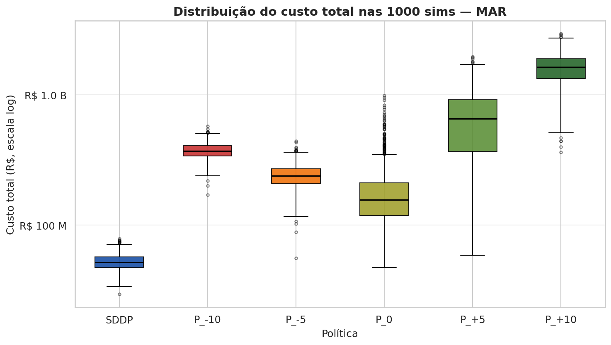
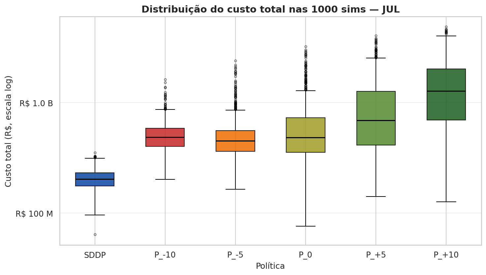
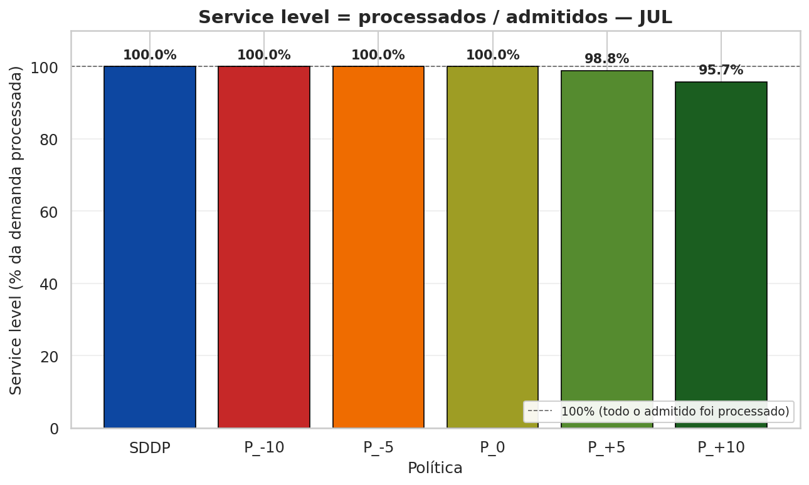
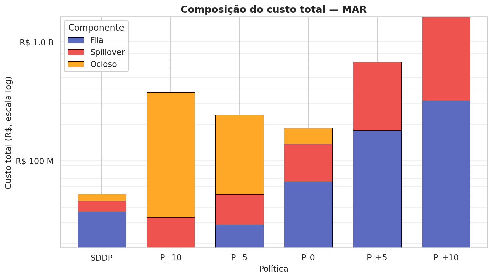
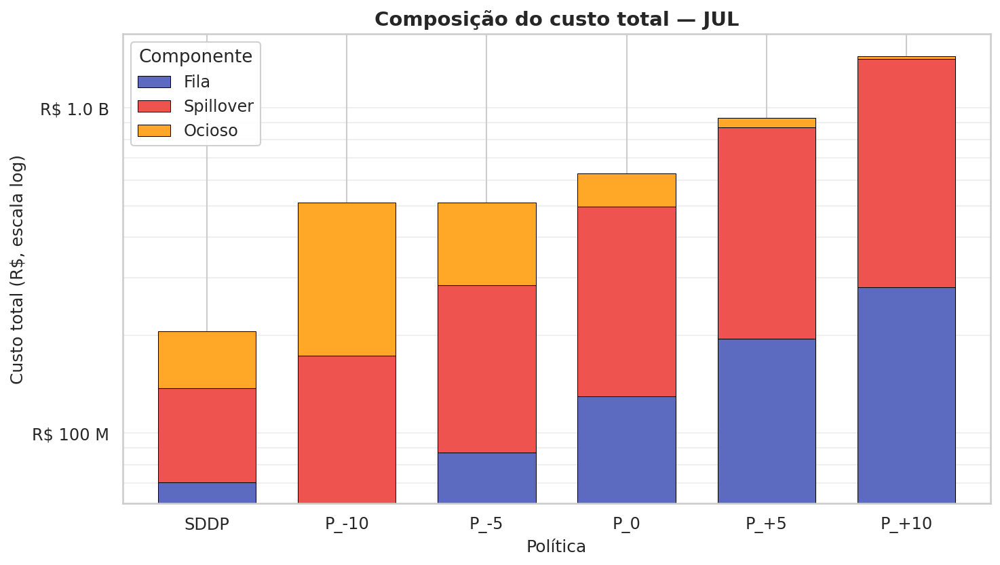
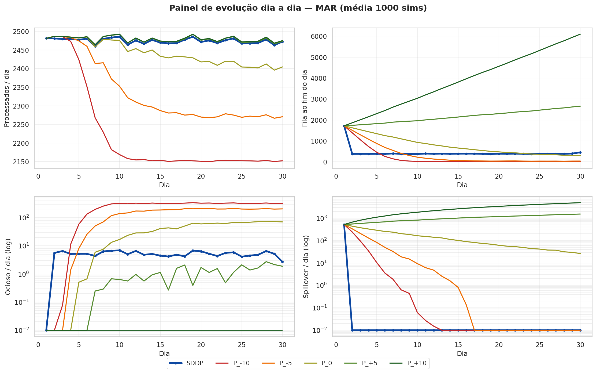
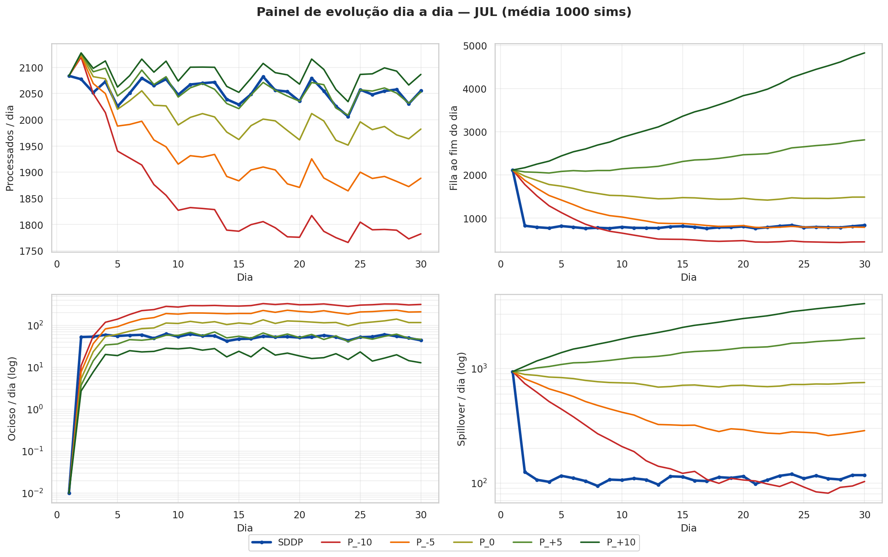
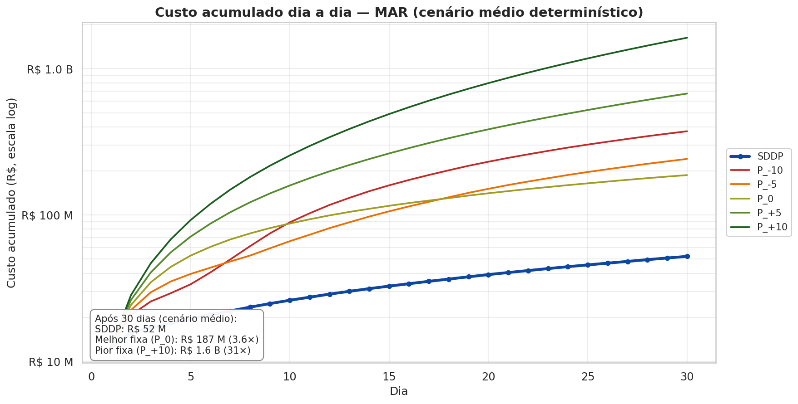
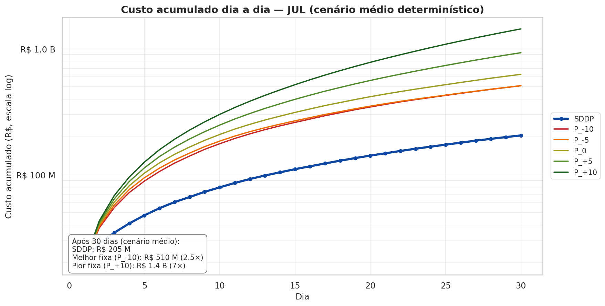
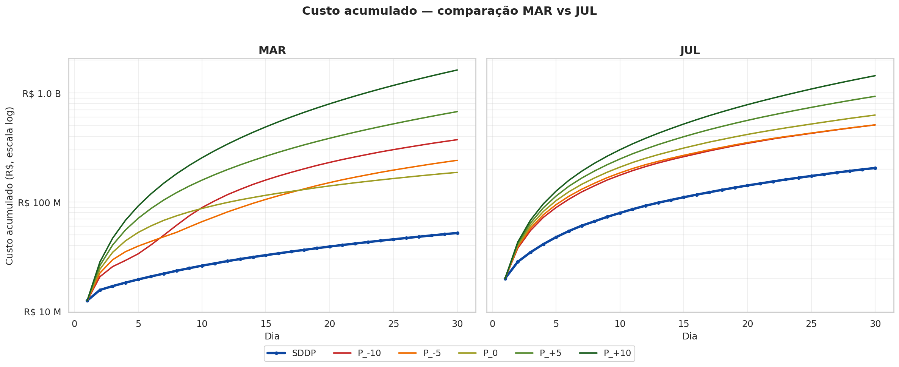

# Análise — SDDP vs Políticas Fixas de Admissão (v8.6)

**Pipeline:**
```
julia model_v8.jl        # exporta CSVs em outputs/csvs/
python plot_v8.py        # gera 15 PNGs
python gerar_analise.py  # gera este ANALISE.md a partir dos CSVs
```

Mês: Março (LogNormal, CV=10%) e Julho (Weibull, CV=36%). Horizonte de 30 dias. SDDP e as 5 fixas avaliados nas **mesmas 1 000 amostras estocásticas** (CRN — common random numbers): cada política vê a mesma realização de w_proc; só muda a regra de admissão.

---

## 1. Modelo

### 1.1 Constantes

| Constante | Valor | Significado |
|-----------|------:|-------------|
| `CAP_ECOPATIO` | 1200 | Capacidade do pátio (gatilho de spillover) |
| `MAX_VAGAS` | 4000 | Limite máximo de admissão `admitidos.out ≤ MAX_VAGAS` |
| `C_FILA` | R$ 2 790 | Custo por caminhão-dia em fila |
| `C_SPILLOVER` | R$ 16 211 | Custo por caminhão fora do pátio (spillover) |
| `C_OCIOSO_TOTAL` | R$ 43 753 | Custo por unidade ociosa (= 1 753 op. + 42 000 receita perdida) |
| `FILA_INICIAL` | 1200 | Fila no dia 1 |
| `ADMITIDOS_INICIAL` | 3000 | Admissão obrigatória no dia 1 |
| `NUM_DIAS` | 30 | Horizonte (dias) |

### 1.2 Variáveis

| Variável | Tipo | Descrição |
|----------|------|-----------|
| `fila[t]` | estado, ≥ 0 | Caminhões em fila no início do dia `t` |
| `admitidos[t]` | estado, [0, 4000] | Caminhões admitidos para o próximo dia |
| `processados[t]` | decisão, ≥ 0 | Caminhões processados no dia |
| `spillover[t]` | decisão, ≥ 0 | Caminhões fora do pátio |
| `ocioso[t]` | decisão, ≥ 0 | Capacidade não utilizada |
| `w_proc[t]` | aleatório | Capacidade aleatória de processamento (estocástico) |

### 1.3 Restrições (∀ t = 1..30)

```
processados[t]    ≤ w_proc[t]
processados[t]    ≤ fila.in[t] + admitidos.in[t]
fila.out[t]       = fila.in[t] + admitidos.in[t] − processados[t]
spillover[t]      ≥ fila.in[t] + admitidos.in[t] − 1200 − processados[t]
ocioso[t]         ≥ w_proc[t] − processados[t]
0 ≤ admitidos[t] ≤ 4000

# Equivalência útil (decorre do balanço): spillover[t] = max(0, fila.out[t] − 1200)
```

### 1.4 Função objetivo (minimização)

```
min  Σ_{t=1..30}  [
        2790     · (fila.in[t] + fila.out[t]) / 2     # custo de fila (regra trapézio)
      + 16211   · spillover[t]                       # custo de spillover
      + 43753   · ocioso[t]                          # custo de ociosidade
     ]
```

---

## 2. Políticas avaliadas (pseudo-código)

### 2.1 SDDP — política dinâmica (referência)

```
Treinamento (offline):
  treinar SDDP com 200 iterações, lower_bound=0, optimizer=HiGHS
  w_proc parametrizado por discretização de quantis (100 pontos) da dist. ajustada

Execução (online, em cada estágio t):
  observa (fila.in[t], admitidos.in[t], w_proc[t])
  decide (processados[t], admitidos.out[t]) minimizando custo
    esperado dos estágios restantes via cortes de Benders
```

### 2.2 Políticas fixas P_X (5 níveis em ±10%, ±5%, 0% da base SDDP)

> **Comparação CRN (common random numbers):** cada política fixa é avaliada nas **MESMAS 1 000 amostras estocásticas de w_proc** que o SDDP viu. A única coisa que muda entre as 6 políticas é a regra de admissão. Comparação 100% justa, com variância reduzida.

```
base = mean(admitidos.out do SDDP, dias 2..30 das 1 000 sims)
X_{P_-10}, X_{P_-5}, X_{P_0}, X_{P_+5}, X_{P_+10}
    = base × [0.90, 0.95, 1.00, 1.05, 1.10]

Estado inicial: fila = 1200,  admitidos.in = 3000

Para cada réplica r = 1..1000:  # mesmas 1 000 trajetórias do SDDP
  Para cada t = 1..30:
    w_proc[r, t]    = w_proc_SDDP[r, t]   ← REUSA a amostra Weibull que o SDDP viu
    processados[t]  = min(w_proc[r, t], fila.in + admitidos.in)
    spillover[t]    = max(0, fila.in + admitidos.in − 1200 − processados[t])
    ocioso[t]       = max(0, w_proc[r, t] − processados[t])
    fila.out        = fila.in + admitidos.in − processados[t]
    admitidos.out   = X    ← REGRA FIXA (constante por toda a simulação)
    fila.in, admitidos.in = fila.out, admitidos.out
```

> **Por que CRN?** Isolar o efeito da decisão de admissão sem ruído entre políticas. Mesma realização do acaso → diferença de custo reflete APENAS a escolha de admissão.

---

## 3. Cenário de avaliação

**Todas as visualizações usam o mesmo conjunto estocástico:** 1 000 simulações com w_proc amostrado da Weibull/LogNormal ajustada (CRN — cada política vê a mesma realização de w_proc).

- Estado inicial idêntico em todas as réplicas (Fila=1200, AdmIn=3000)
- **§5 (Indicadores):** custo médio, IC 95%, quantis, spillover total calculados sobre as 1 000 sims
- **Anexos A/B:** mostram a **trajetória média** dia-a-dia (cada célula = média das 1 000 realizações naquele dia)
- **Gráfico de custo acumulado:** soma cumulativa da trajetória média dia-a-dia

**Consistência:** a Σ Custo de cada política nos Anexos A/B bate **exato** com o `Custo médio` de §5 e com o ponto final do gráfico de custo acumulado (linearidade de média + soma).

> **Caveat (Jensen):** as fórmulas operacionais (`Spill = max(0, FilaFim − 1 200)`, `Proc = min(w_proc, fila+adm)`, etc.) **não batem linha-a-linha** porque são não-lineares. Ex.: `mean(max(0, X)) ≥ max(0, mean(X))`. Para uma trajetória onde as fórmulas batem exato (e que pode ser comparada com o anexo médio), ver Anexos C/D (réplica estocástica idx=42).

---

## 4. Dados e distribuições

| Mês | Média (cam/dia) | sd | CV | Dist | AIC | KS p-value |
|-----|----------------:|---:|---:|------|----:|-----------:|
| mar | 2 480.2 | 251.3 | 0.10 | **LogNormal** | 417.5 | 0.55 |
| jul | 2 102.1 | 754.6 | 0.36 | **Weibull** | 484.8 | 0.93 |

Critério: menor AIC entre os modelos com KS p ≥ 0.05. Ajuste em `ranking AIC/KS impresso no terminal`.

**Bases X (média de adm_out SDDP nos dias 2..30):**

| Mês | base | X(P_-10) | X(P_-5) | X(P_0) | X(P_+5) | X(P_+10) |
|-----|-----:|---------:|--------:|-------:|--------:|---------:|
| MAR | 2 391 | 2 152 | 2 272 | 2 391 | 2 511 | 2 630 |
| JUL | 1 983 | 1 785 | 1 884 | 1 983 | 2 082 | 2 181 |

---

## 5. Indicadores

### 5.1 Glossário

| Indicador | Definição |
|-----------|-----------|
| **Custo médio** | Esperança do custo total dos 30 dias (média 1 000 sims) |
| **IC 95%** | Intervalo de confiança 95% do custo médio (`± 1.96·sd/√N`) |
| **P5 / P50 / P95** | Quantis 5%, 50% (mediana), 95% da distribuição do custo |
| **Spill total (30d)** | Spillover total acumulado nos 30 dias (média 1 000 sims) |
| **Fila pico** | Média do pico de fila ao longo dos 30 dias (limite MAX_VAGAS=4000) |
| **Service level** | Σ proc / Σ admitidos nos dias 2..30, cap em 100% |
| **entram/proc/ocio/spill/dia** | Médias diárias das 4 quantidades operacionais |

### 5.2 MAR — valores

| Indicador | SDDP | P_-10 | P_-5 | P_0 | P_+5 | P_+10 |
|-----------|-----:|------:|-----:|----:|-----:|------:|
| Custo médio | R$ 52.1 M | R$ 373.4 M | R$ 241.6 M | R$ 187.3 M | R$ 675.6 M | R$ 1.63 B |
| IC 95% | ± 0.45 M | ± 3.23 M | ± 3.11 M | ± 7.05 M | ± 23.40 M | ± 26.64 M |
| P5 (custo) | R$ 40.8 M | R$ 293.3 M | R$ 164.0 M | R$ 85.1 M | R$ 123.3 M | R$ 920.8 M |
| P50 (custo) | R$ 51.5 M | R$ 370.8 M | R$ 239.3 M | R$ 156.1 M | R$ 655.4 M | R$ 1.64 B |
| P95 (custo) | R$ 64.5 M | R$ 465.5 M | R$ 330.4 M | R$ 408.5 M | R$ 1.34 B | R$ 2.32 B |
| Spill total (30d) | 519 | 906 | 1 414 | 4 417 | 30 559 | 80 632 |
| Fila pico | 1 719 | 1 725 | 1 749 | 1 889 | 3 118 | 6 175 |
| Service level | 100.0% | 100.0% | 100.0% | 100.0% | 98.7% | 94.3% |
| entram/dia | 2 449 | 2 180 | 2 296 | 2 411 | 2 527 | 2 643 |
| proc/dia | 2 474 | 2 220 | 2 335 | 2 442 | 2 478 | 2 479 |
| ocio/dia | 5 | 259 | 145 | 38 | 1 | 0 |
| spill/dia | 17 | 30 | 47 | 147 | 1 019 | 2 688 |

**Melhor fixa MAR:** P_0 = R$ 187.3 M (3.59× SDDP). **Pior:** P_+10 = R$ 1.63 B (31× SDDP).

### 5.3 JUL — valores

| Indicador | SDDP | P_-10 | P_-5 | P_0 | P_+5 | P_+10 |
|-----------|-----:|------:|-----:|----:|-----:|------:|
| Custo médio | R$ 205.5 M | R$ 510.1 M | R$ 510.3 M | R$ 628.1 M | R$ 932.9 M | R$ 1.44 B |
| IC 95% | ± 2.64 M | ± 10.15 M | ± 16.19 M | ± 27.57 M | ± 42.84 M | ± 56.97 M |
| P5 (custo) | R$ 139.8 M | R$ 303.5 M | R$ 268.2 M | R$ 241.5 M | R$ 249.9 M | R$ 309.1 M |
| P50 (custo) | R$ 202.9 M | R$ 486.8 M | R$ 451.2 M | R$ 482.8 M | R$ 690.9 M | R$ 1.28 B |
| P95 (custo) | R$ 280.3 M | R$ 783.8 M | R$ 950.2 M | R$ 1.55 B | R$ 2.35 B | R$ 3.17 B |
| Spill total (30d) | 4 119 | 6 915 | 12 163 | 22 662 | 41 646 | 70 029 |
| Fila pico | 2 368 | 2 623 | 2 974 | 3 588 | 4 583 | 6 111 |
| Service level | 100.0% | 100.0% | 100.0% | 100.0% | 98.8% | 95.7% |
| entram/dia | 2 043 | 1 825 | 1 921 | 2 017 | 2 113 | 2 209 |
| proc/dia | 2 055 | 1 850 | 1 935 | 2 007 | 2 059 | 2 088 |
| ocio/dia | 52 | 257 | 172 | 100 | 48 | 19 |
| spill/dia | 137 | 230 | 405 | 755 | 1 388 | 2 334 |

**Melhor fixa JUL:** P_0 = R$ 628.1 M (3.06× SDDP). **Pior:** P_+10 = R$ 1.44 B (7× SDDP).

---

## 6. Gráficos

Cada gráfico abaixo é gerado por `plot_v8.py` a partir de `outputs/csvs/`. PNGs em `outputs/graficos/`.

### 6.1 Boxplot custo total (1 000 sims, log)
Distribuição do custo total entre as 1 000 réplicas para cada política (CRN — mesma realização de w_proc em todas).





### 6.2 Service level por política
Fração da demanda admitida que é de fato processada nos dias 2..30 (cap 100%).




### 6.3 Composição do custo
Decompõe o custo total em fila + spillover + ociosidade (escala log).





### 6.4 Painel 4 variáveis (proc / fila / ocio log / spill log)
Evolução diária de 4 quantidades-chave por política.





### 6.5 Custo acumulado (log)
Soma cumulativa do custo dia a dia — "o gráfico do dinheiro".





### 6.6 Comparativo mar vs jul (side-by-side)



---

## Anexo A — MAR: trajetória média estocástica (6 políticas, 30 dias)

Cada célula = média diária entre as 1 000 sims estocásticas (CRN — mesma realização de w_proc em todas as políticas). **Σ Custo bate exato com `Custo médio` da §5.** As fórmulas operacionais NÃO batem linha-a-linha (Jensen) — para trajetória onde batem, ver Anexos C/D.

### MAR — `SDDP` — trajetória média das 1 000 sims

| Dia | FilaIni | AdmIn | w_proc | Proc | FilaFim | Spill | Ocioso | AdmOut | Custo |
|----:|--------:|------:|-------:|-----:|--------:|------:|-------:|-------:|------:|
| 1 | 1200 | 3000 | 2481 | 2481 | 1719 | 519.1 | 0.0 | 1138 | 12.49M |
| 2 | 1719 | 1138 | 2486 | 2481 | 376.2 | 0.0 | 5.6 | 2481 | 3.17M |
| 3 | 376.2 | 2481 | 2486 | 2479 | 377.6 | 0.0 | 6.5 | 2479 | 1.34M |
| 4 | 377.6 | 2479 | 2484 | 2479 | 377.7 | 0.0 | 5.1 | 2479 | 1.28M |
| 5 | 377.7 | 2479 | 2482 | 2477 | 379.7 | 0.0 | 5.2 | 2477 | 1.28M |
| 6 | 379.7 | 2477 | 2485 | 2480 | 376.7 | 0.0 | 5.2 | 2480 | 1.28M |
| 7 | 376.7 | 2480 | 2464 | 2460 | 397.3 | 0.0 | 4.4 | 2460 | 1.27M |
| 8 | 397.3 | 2460 | 2486 | 2480 | 377.1 | 0.0 | 6.3 | 2480 | 1.36M |
| 9 | 377.1 | 2480 | 2490 | 2483 | 373.7 | 0.0 | 6.7 | 2483 | 1.34M |
| 10 | 373.7 | 2483 | 2492 | 2486 | 371.5 | 0.0 | 6.9 | 2486 | 1.34M |
| 11 | 371.5 | 2486 | 2469 | 2464 | 392.9 | 0.0 | 5.0 | 2464 | 1.29M |
| 12 | 392.9 | 2464 | 2482 | 2476 | 381.4 | 0.0 | 6.6 | 2476 | 1.37M |
| 13 | 381.4 | 2476 | 2471 | 2466 | 390.7 | 0.0 | 4.8 | 2466 | 1.29M |
| 14 | 390.7 | 2466 | 2482 | 2477 | 380.0 | 0.0 | 5.1 | 2477 | 1.30M |
| 15 | 380.0 | 2477 | 2474 | 2470 | 387.4 | 0.0 | 4.5 | 2470 | 1.27M |
| 16 | 387.4 | 2470 | 2472 | 2468 | 389.2 | 0.0 | 4.2 | 2468 | 1.27M |
| 17 | 389.2 | 2468 | 2473 | 2468 | 388.6 | 0.0 | 4.8 | 2468 | 1.30M |
| 18 | 388.6 | 2468 | 2482 | 2478 | 379.5 | 0.0 | 4.2 | 2478 | 1.26M |
| 19 | 379.5 | 2478 | 2492 | 2486 | 371.5 | 0.0 | 6.8 | 2486 | 1.34M |
| 20 | 371.5 | 2486 | 2478 | 2471 | 385.7 | 0.0 | 6.4 | 2471 | 1.34M |
| 21 | 385.7 | 2471 | 2481 | 2476 | 381.5 | 0.0 | 5.2 | 2476 | 1.30M |
| 22 | 381.5 | 2476 | 2473 | 2468 | 388.7 | 0.0 | 4.3 | 2468 | 1.26M |
| 23 | 388.7 | 2468 | 2482 | 2476 | 380.9 | 0.0 | 5.6 | 2476 | 1.32M |
| 24 | 380.9 | 2476 | 2487 | 2481 | 376.1 | 0.0 | 5.9 | 2481 | 1.31M |
| 25 | 376.1 | 2481 | 2472 | 2467 | 389.5 | 0.0 | 4.1 | 2467 | 1.25M |
| 26 | 389.5 | 2467 | 2473 | 2468 | 388.9 | 0.0 | 4.5 | 2468 | 1.28M |
| 27 | 388.9 | 2468 | 2474 | 2469 | 388.3 | 0.0 | 4.8 | 2469 | 1.29M |
| 28 | 388.3 | 2469 | 2484 | 2478 | 379.0 | 0.0 | 6.5 | 2478 | 1.35M |
| 29 | 379.0 | 2478 | 2468 | 2463 | 394.0 | 0.0 | 5.2 | 2531 | 1.31M |
| 30 | 394.0 | 2531 | 2475 | 2472 | 452.7 | 0.0 | 2.7 | 0.0 | 1.30M |
| **Σ** | — | — | — | **74228** | — | **519.1** | **153.0** | — | **52.12M** |

### MAR — `P_-10` — trajetória média das 1 000 sims

| Dia | FilaIni | AdmIn | w_proc | Proc | FilaFim | Spill | Ocioso | AdmOut | Custo |
|----:|--------:|------:|-------:|-----:|--------:|------:|-------:|-------:|------:|
| 1 | 1200 | 3000 | 2481 | 2481 | 1719 | 519.1 | 0.0 | 2152 | 12.49M |
| 2 | 1719 | 2152 | 2486 | 2486 | 1384 | 240.5 | 0.0 | 2152 | 8.23M |
| 3 | 1384 | 2152 | 2486 | 2486 | 1051 | 94.7 | 0.1 | 2152 | 4.94M |
| 4 | 1051 | 2152 | 2484 | 2473 | 729.6 | 34.5 | 11.4 | 2152 | 3.54M |
| 5 | 729.6 | 2152 | 2482 | 2424 | 457.7 | 10.5 | 58.5 | 2152 | 4.39M |
| 6 | 457.7 | 2152 | 2485 | 2351 | 258.5 | 3.6 | 134.2 | 2152 | 6.93M |
| 7 | 258.5 | 2152 | 2464 | 2268 | 142.7 | 1.9 | 196.3 | 2152 | 9.18M |
| 8 | 142.7 | 2152 | 2486 | 2229 | 65.7 | 0.6 | 257.3 | 2152 | 11.56M |
| 9 | 65.7 | 2152 | 2490 | 2182 | 35.6 | 0.4 | 307.9 | 2152 | 13.62M |
| 10 | 35.6 | 2152 | 2492 | 2169 | 18.7 | 0.1 | 323.5 | 2152 | 14.23M |
| 11 | 18.7 | 2152 | 2469 | 2158 | 12.7 | 0.0 | 311.1 | 2152 | 13.66M |
| 12 | 12.7 | 2152 | 2482 | 2155 | 10.2 | 0.0 | 327.6 | 2152 | 14.37M |
| 13 | 10.2 | 2152 | 2471 | 2155 | 6.8 | 0.0 | 315.7 | 2152 | 13.84M |
| 14 | 6.8 | 2152 | 2482 | 2152 | 6.5 | 0.0 | 329.8 | 2152 | 14.45M |
| 15 | 6.5 | 2152 | 2474 | 2154 | 5.0 | 0.0 | 320.5 | 2152 | 14.04M |
| 16 | 5.0 | 2152 | 2472 | 2151 | 6.4 | 0.0 | 321.4 | 2152 | 14.08M |
| 17 | 6.4 | 2152 | 2473 | 2152 | 6.5 | 0.0 | 321.3 | 2152 | 14.08M |
| 18 | 6.5 | 2152 | 2482 | 2153 | 5.0 | 0.0 | 328.3 | 2152 | 14.38M |
| 19 | 5.0 | 2152 | 2492 | 2152 | 4.9 | 0.0 | 340.2 | 2152 | 14.90M |
| 20 | 4.9 | 2152 | 2478 | 2151 | 6.0 | 0.0 | 326.7 | 2152 | 14.31M |
| 21 | 6.0 | 2152 | 2481 | 2150 | 8.2 | 0.0 | 331.0 | 2152 | 14.50M |
| 22 | 8.2 | 2152 | 2473 | 2153 | 7.7 | 0.0 | 320.1 | 2152 | 14.03M |
| 23 | 7.7 | 2152 | 2482 | 2154 | 6.2 | 0.0 | 328.2 | 2152 | 14.38M |
| 24 | 6.2 | 2152 | 2487 | 2153 | 5.5 | 0.0 | 334.1 | 2152 | 14.63M |
| 25 | 5.5 | 2152 | 2472 | 2152 | 5.2 | 0.0 | 319.2 | 2152 | 13.98M |
| 26 | 5.2 | 2152 | 2473 | 2152 | 5.2 | 0.0 | 320.6 | 2152 | 14.04M |
| 27 | 5.2 | 2152 | 2474 | 2151 | 5.9 | 0.0 | 322.3 | 2152 | 14.12M |
| 28 | 5.9 | 2152 | 2484 | 2153 | 4.9 | 0.0 | 331.4 | 2152 | 14.51M |
| 29 | 4.9 | 2152 | 2468 | 2150 | 6.6 | 0.0 | 317.9 | 2152 | 13.92M |
| 30 | 6.6 | 2152 | 2475 | 2152 | 6.4 | 0.0 | 322.8 | 2152 | 14.14M |
| **Σ** | — | — | — | **66602** | — | **906.0** | **7779** | — | **373.44M** |

### MAR — `P_-5` — trajetória média das 1 000 sims

| Dia | FilaIni | AdmIn | w_proc | Proc | FilaFim | Spill | Ocioso | AdmOut | Custo |
|----:|--------:|------:|-------:|-----:|--------:|------:|-------:|-------:|------:|
| 1 | 1200 | 3000 | 2481 | 2481 | 1719 | 519.1 | 0.0 | 2272 | 12.49M |
| 2 | 1719 | 2272 | 2486 | 2486 | 1504 | 333.3 | 0.0 | 2272 | 9.90M |
| 3 | 1504 | 2272 | 2486 | 2486 | 1290 | 206.9 | 0.0 | 2272 | 7.25M |
| 4 | 1290 | 2272 | 2484 | 2483 | 1078 | 129.5 | 1.4 | 2272 | 5.46M |
| 5 | 1078 | 2272 | 2482 | 2474 | 875.3 | 82.9 | 8.0 | 2272 | 4.42M |
| 6 | 875.3 | 2272 | 2485 | 2460 | 687.2 | 50.0 | 25.7 | 2272 | 4.12M |
| 7 | 687.2 | 2272 | 2464 | 2414 | 545.2 | 32.5 | 50.5 | 2272 | 4.46M |
| 8 | 545.2 | 2272 | 2486 | 2415 | 401.4 | 18.9 | 70.8 | 2272 | 4.72M |
| 9 | 401.4 | 2272 | 2490 | 2372 | 301.0 | 15.0 | 118.1 | 2272 | 6.39M |
| 10 | 301.0 | 2272 | 2492 | 2352 | 220.1 | 9.4 | 139.9 | 2272 | 7.00M |
| 11 | 220.1 | 2272 | 2469 | 2322 | 170.1 | 6.2 | 147.5 | 2272 | 7.10M |
| 12 | 170.1 | 2272 | 2482 | 2310 | 131.6 | 4.8 | 172.1 | 2272 | 8.03M |
| 13 | 131.6 | 2272 | 2471 | 2301 | 102.3 | 2.6 | 170.2 | 2272 | 7.81M |
| 14 | 102.3 | 2272 | 2482 | 2297 | 77.2 | 1.6 | 185.4 | 2272 | 8.39M |
| 15 | 77.2 | 2272 | 2474 | 2287 | 61.7 | 0.8 | 187.0 | 2272 | 8.39M |
| 16 | 61.7 | 2272 | 2472 | 2281 | 52.7 | 0.1 | 191.4 | 2272 | 8.54M |
| 17 | 52.7 | 2272 | 2473 | 2281 | 43.0 | 0.0 | 192.0 | 2272 | 8.53M |
| 18 | 43.0 | 2272 | 2482 | 2275 | 39.6 | 0.0 | 206.8 | 2272 | 9.16M |
| 19 | 39.6 | 2272 | 2492 | 2277 | 34.6 | 0.0 | 215.7 | 2272 | 9.54M |
| 20 | 34.6 | 2272 | 2478 | 2270 | 36.5 | 0.0 | 208.0 | 2272 | 9.20M |
| 21 | 36.5 | 2272 | 2481 | 2268 | 40.2 | 0.0 | 212.8 | 2272 | 9.42M |
| 22 | 40.2 | 2272 | 2473 | 2270 | 41.6 | 0.0 | 202.4 | 2272 | 8.97M |
| 23 | 41.6 | 2272 | 2482 | 2279 | 34.6 | 0.0 | 203.2 | 2272 | 9.00M |
| 24 | 34.6 | 2272 | 2487 | 2275 | 31.2 | 0.0 | 211.8 | 2272 | 9.36M |
| 25 | 31.2 | 2272 | 2472 | 2269 | 33.7 | 0.0 | 202.5 | 2272 | 8.95M |
| 26 | 33.7 | 2272 | 2473 | 2272 | 33.1 | 0.0 | 200.4 | 2272 | 8.86M |
| 27 | 33.1 | 2272 | 2474 | 2271 | 34.0 | 0.0 | 202.9 | 2272 | 8.97M |
| 28 | 34.0 | 2272 | 2484 | 2276 | 29.7 | 0.0 | 208.5 | 2272 | 9.21M |
| 29 | 29.7 | 2272 | 2468 | 2267 | 34.7 | 0.0 | 201.6 | 2272 | 8.91M |
| 30 | 34.7 | 2272 | 2475 | 2270 | 35.8 | 0.0 | 204.5 | 2272 | 9.04M |
| **Σ** | — | — | — | **70040** | — | **1414** | **4341** | — | **241.60M** |

### MAR — `P_0` — trajetória média das 1 000 sims

| Dia | FilaIni | AdmIn | w_proc | Proc | FilaFim | Spill | Ocioso | AdmOut | Custo |
|----:|--------:|------:|-------:|-----:|--------:|------:|-------:|-------:|------:|
| 1 | 1200 | 3000 | 2481 | 2481 | 1719 | 519.1 | 0.0 | 2391 | 12.49M |
| 2 | 1719 | 2391 | 2486 | 2486 | 1624 | 437.6 | 0.0 | 2391 | 11.76M |
| 3 | 1624 | 2391 | 2486 | 2486 | 1529 | 373.4 | 0.0 | 2391 | 10.45M |
| 4 | 1529 | 2391 | 2484 | 2484 | 1435 | 327.8 | 0.0 | 2391 | 9.45M |
| 5 | 1435 | 2391 | 2482 | 2482 | 1345 | 289.5 | 0.5 | 2391 | 8.59M |
| 6 | 1345 | 2391 | 2485 | 2485 | 1251 | 255.1 | 0.7 | 2391 | 7.79M |
| 7 | 1251 | 2391 | 2464 | 2458 | 1184 | 237.4 | 5.9 | 2391 | 7.50M |
| 8 | 1184 | 2391 | 2486 | 2479 | 1096 | 203.3 | 7.6 | 2391 | 6.81M |
| 9 | 1096 | 2391 | 2490 | 2477 | 1011 | 186.6 | 13.3 | 2391 | 6.55M |
| 10 | 1011 | 2391 | 2492 | 2476 | 926.4 | 163.9 | 16.8 | 2391 | 6.09M |
| 11 | 926.4 | 2391 | 2469 | 2446 | 871.8 | 152.7 | 23.5 | 2391 | 6.01M |
| 12 | 871.8 | 2391 | 2482 | 2454 | 809.4 | 140.9 | 28.6 | 2391 | 5.88M |
| 13 | 809.4 | 2391 | 2471 | 2442 | 758.2 | 131.3 | 28.7 | 2391 | 5.57M |
| 14 | 758.2 | 2391 | 2482 | 2450 | 699.5 | 112.7 | 32.3 | 2391 | 5.27M |
| 15 | 699.5 | 2391 | 2474 | 2433 | 657.7 | 101.6 | 41.1 | 2391 | 5.34M |
| 16 | 657.7 | 2391 | 2472 | 2429 | 620.1 | 90.0 | 43.3 | 2391 | 5.14M |
| 17 | 620.1 | 2391 | 2473 | 2433 | 578.0 | 81.9 | 40.0 | 2391 | 4.75M |
| 18 | 578.0 | 2391 | 2482 | 2431 | 537.8 | 74.3 | 50.4 | 2391 | 4.97M |
| 19 | 537.8 | 2391 | 2492 | 2429 | 500.2 | 69.1 | 63.5 | 2391 | 5.35M |
| 20 | 500.2 | 2391 | 2478 | 2418 | 473.5 | 61.7 | 59.9 | 2391 | 4.98M |
| 21 | 473.5 | 2391 | 2481 | 2419 | 445.6 | 56.2 | 61.8 | 2391 | 4.90M |
| 22 | 445.6 | 2391 | 2473 | 2409 | 428.1 | 53.7 | 63.9 | 2391 | 4.89M |
| 23 | 428.1 | 2391 | 2482 | 2420 | 399.6 | 48.9 | 62.1 | 2391 | 4.67M |
| 24 | 399.6 | 2391 | 2487 | 2420 | 371.1 | 44.1 | 67.2 | 2391 | 4.73M |
| 25 | 371.1 | 2391 | 2472 | 2404 | 358.1 | 41.8 | 67.4 | 2391 | 4.64M |
| 26 | 358.1 | 2391 | 2473 | 2404 | 345.6 | 37.7 | 69.0 | 2391 | 4.61M |
| 27 | 345.6 | 2391 | 2474 | 2402 | 335.0 | 37.2 | 71.8 | 2391 | 4.69M |
| 28 | 335.0 | 2391 | 2484 | 2412 | 313.7 | 31.5 | 72.0 | 2391 | 4.57M |
| 29 | 313.7 | 2391 | 2468 | 2396 | 309.1 | 29.8 | 72.4 | 2391 | 4.52M |
| 30 | 309.1 | 2391 | 2475 | 2404 | 295.9 | 26.4 | 70.6 | 2391 | 4.36M |
| **Σ** | — | — | — | **73247** | — | **4417** | **1134** | — | **187.30M** |

### MAR — `P_+5` — trajetória média das 1 000 sims

| Dia | FilaIni | AdmIn | w_proc | Proc | FilaFim | Spill | Ocioso | AdmOut | Custo |
|----:|--------:|------:|-------:|-----:|--------:|------:|-------:|-------:|------:|
| 1 | 1200 | 3000 | 2481 | 2481 | 1719 | 519.1 | 0.0 | 2511 | 12.49M |
| 2 | 1719 | 2511 | 2486 | 2486 | 1743 | 549.4 | 0.0 | 2511 | 13.74M |
| 3 | 1743 | 2511 | 2486 | 2486 | 1768 | 579.6 | 0.0 | 2511 | 14.29M |
| 4 | 1768 | 2511 | 2484 | 2484 | 1794 | 615.8 | 0.0 | 2511 | 14.95M |
| 5 | 1794 | 2511 | 2482 | 2482 | 1822 | 651.3 | 0.0 | 2511 | 15.60M |
| 6 | 1822 | 2511 | 2485 | 2485 | 1848 | 682.8 | 0.0 | 2511 | 16.19M |
| 7 | 1848 | 2511 | 2464 | 2464 | 1894 | 736.1 | 0.2 | 2511 | 17.16M |
| 8 | 1894 | 2511 | 2486 | 2486 | 1919 | 762.7 | 0.3 | 2511 | 17.70M |
| 9 | 1919 | 2511 | 2490 | 2489 | 1941 | 792.5 | 0.7 | 2511 | 18.26M |
| 10 | 1941 | 2511 | 2492 | 2492 | 1960 | 815.5 | 0.6 | 2511 | 18.69M |
| 11 | 1960 | 2511 | 2469 | 2469 | 2002 | 861.8 | 0.6 | 2511 | 19.52M |
| 12 | 2002 | 2511 | 2482 | 2481 | 2031 | 894.8 | 1.0 | 2511 | 20.17M |
| 13 | 2031 | 2511 | 2471 | 2471 | 2071 | 935.2 | 0.6 | 2511 | 20.91M |
| 14 | 2071 | 2511 | 2482 | 2481 | 2101 | 964.4 | 0.9 | 2511 | 21.49M |
| 15 | 2101 | 2511 | 2474 | 2473 | 2139 | 1008 | 1.1 | 2511 | 22.30M |
| 16 | 2139 | 2511 | 2472 | 2472 | 2178 | 1048 | 0.3 | 2511 | 23.02M |
| 17 | 2178 | 2511 | 2473 | 2472 | 2217 | 1085 | 1.6 | 2511 | 23.78M |
| 18 | 2217 | 2511 | 2482 | 2480 | 2248 | 1116 | 2.1 | 2511 | 24.41M |
| 19 | 2248 | 2511 | 2492 | 2492 | 2266 | 1140 | 0.4 | 2511 | 24.79M |
| 20 | 2266 | 2511 | 2478 | 2476 | 2301 | 1174 | 1.7 | 2511 | 25.48M |
| 21 | 2301 | 2511 | 2481 | 2480 | 2332 | 1203 | 1.1 | 2511 | 26.01M |
| 22 | 2332 | 2511 | 2473 | 2471 | 2372 | 1242 | 1.6 | 2511 | 26.77M |
| 23 | 2372 | 2511 | 2482 | 2481 | 2401 | 1272 | 0.5 | 2511 | 27.31M |
| 24 | 2401 | 2511 | 2487 | 2486 | 2426 | 1298 | 1.1 | 2511 | 27.83M |
| 25 | 2426 | 2511 | 2472 | 2469 | 2467 | 1342 | 2.1 | 2511 | 28.67M |
| 26 | 2467 | 2511 | 2473 | 2471 | 2507 | 1382 | 1.4 | 2511 | 29.40M |
| 27 | 2507 | 2511 | 2474 | 2472 | 2546 | 1423 | 1.6 | 2511 | 30.18M |
| 28 | 2546 | 2511 | 2484 | 2482 | 2575 | 1449 | 2.7 | 2511 | 30.76M |
| 29 | 2575 | 2511 | 2468 | 2466 | 2619 | 1490 | 2.2 | 2511 | 31.50M |
| 30 | 2619 | 2511 | 2475 | 2473 | 2657 | 1526 | 1.9 | 2511 | 32.18M |
| **Σ** | — | — | — | **74353** | — | **30559** | **28.2** | — | **675.56M** |

### MAR — `P_+10` — trajetória média das 1 000 sims

| Dia | FilaIni | AdmIn | w_proc | Proc | FilaFim | Spill | Ocioso | AdmOut | Custo |
|----:|--------:|------:|-------:|-----:|--------:|------:|-------:|-------:|------:|
| 1 | 1200 | 3000 | 2481 | 2481 | 1719 | 519.1 | 0.0 | 2630 | 12.49M |
| 2 | 1719 | 2630 | 2486 | 2486 | 1863 | 665.4 | 0.0 | 2630 | 15.78M |
| 3 | 1863 | 2630 | 2486 | 2486 | 2007 | 808.9 | 0.0 | 2630 | 18.51M |
| 4 | 2007 | 2630 | 2484 | 2484 | 2153 | 955.7 | 0.0 | 2630 | 21.30M |
| 5 | 2153 | 2630 | 2482 | 2482 | 2301 | 1103 | 0.0 | 2630 | 24.10M |
| 6 | 2301 | 2630 | 2485 | 2485 | 2445 | 1247 | 0.0 | 2630 | 26.83M |
| 7 | 2445 | 2630 | 2464 | 2464 | 2612 | 1414 | 0.0 | 2630 | 29.98M |
| 8 | 2612 | 2630 | 2486 | 2486 | 2756 | 1558 | 0.0 | 2630 | 32.74M |
| 9 | 2756 | 2630 | 2490 | 2490 | 2896 | 1699 | 0.0 | 2630 | 35.42M |
| 10 | 2896 | 2630 | 2492 | 2492 | 3034 | 1836 | 0.0 | 2630 | 38.04M |
| 11 | 3034 | 2630 | 2469 | 2469 | 3195 | 1997 | 0.0 | 2630 | 41.06M |
| 12 | 3195 | 2630 | 2482 | 2482 | 3343 | 2145 | 0.0 | 2630 | 43.89M |
| 13 | 3343 | 2630 | 2471 | 2471 | 3502 | 2304 | 0.0 | 2630 | 46.90M |
| 14 | 3502 | 2630 | 2482 | 2482 | 3650 | 2451 | 0.0 | 2630 | 49.72M |
| 15 | 3650 | 2630 | 2474 | 2474 | 3806 | 2607 | 0.0 | 2630 | 52.67M |
| 16 | 3806 | 2630 | 2472 | 2472 | 3965 | 2765 | 0.0 | 2630 | 55.66M |
| 17 | 3965 | 2630 | 2473 | 2473 | 4122 | 2922 | 0.0 | 2630 | 58.65M |
| 18 | 4122 | 2630 | 2482 | 2482 | 4270 | 3070 | 0.0 | 2630 | 61.48M |
| 19 | 4270 | 2630 | 2492 | 2492 | 4408 | 3208 | 0.0 | 2630 | 64.11M |
| 20 | 4408 | 2630 | 2478 | 2478 | 4561 | 3361 | 0.0 | 2630 | 66.99M |
| 21 | 4561 | 2630 | 2481 | 2481 | 4710 | 3510 | 0.0 | 2630 | 69.84M |
| 22 | 4710 | 2630 | 2473 | 2473 | 4868 | 3668 | 0.0 | 2630 | 72.82M |
| 23 | 4868 | 2630 | 2482 | 2482 | 5016 | 3816 | 0.0 | 2630 | 75.65M |
| 24 | 5016 | 2630 | 2487 | 2487 | 5160 | 3960 | 0.0 | 2630 | 78.39M |
| 25 | 5160 | 2630 | 2472 | 2472 | 5318 | 4118 | 0.0 | 2630 | 81.38M |
| 26 | 5318 | 2630 | 2473 | 2473 | 5476 | 4276 | 0.0 | 2630 | 84.38M |
| 27 | 5476 | 2630 | 2474 | 2474 | 5633 | 4433 | 0.0 | 2630 | 87.36M |
| 28 | 5633 | 2630 | 2484 | 2484 | 5779 | 4579 | 0.0 | 2630 | 90.14M |
| 29 | 5779 | 2630 | 2468 | 2468 | 5941 | 4741 | 0.0 | 2630 | 93.20M |
| 30 | 5941 | 2630 | 2475 | 2475 | 6096 | 4896 | 0.0 | 2630 | 96.16M |
| **Σ** | — | — | — | **74381** | — | **80632** | **0.0** | — | **1625.61M** |

---

## Anexo B — JUL: trajetória média estocástica (6 políticas, 30 dias)

Cada célula = média diária entre as 1 000 sims estocásticas (CRN — mesma realização de w_proc em todas as políticas). **Σ Custo bate exato com `Custo médio` da §5.** As fórmulas operacionais NÃO batem linha-a-linha (Jensen) — para trajetória onde batem, ver Anexos C/D.

### JUL — `SDDP` — trajetória média das 1 000 sims

| Dia | FilaIni | AdmIn | w_proc | Proc | FilaFim | Spill | Ocioso | AdmOut | Custo |
|----:|--------:|------:|-------:|-----:|--------:|------:|-------:|-------:|------:|
| 1 | 1200 | 3000 | 2084 | 2084 | 2116 | 943.7 | 0.0 | 785.8 | 19.92M |
| 2 | 2116 | 785.8 | 2130 | 2077 | 824.9 | 125.0 | 52.9 | 2019 | 8.44M |
| 3 | 824.9 | 2019 | 2106 | 2052 | 792.1 | 106.6 | 53.8 | 2052 | 6.34M |
| 4 | 792.1 | 2052 | 2132 | 2073 | 771.3 | 102.4 | 59.7 | 2073 | 6.46M |
| 5 | 771.3 | 2073 | 2081 | 2025 | 818.5 | 115.7 | 55.9 | 2025 | 6.54M |
| 6 | 818.5 | 2025 | 2109 | 2051 | 793.3 | 110.4 | 58.4 | 2051 | 6.59M |
| 7 | 793.3 | 2051 | 2139 | 2079 | 764.6 | 104.0 | 59.6 | 2079 | 6.47M |
| 8 | 764.6 | 2079 | 2115 | 2065 | 778.5 | 94.3 | 49.3 | 2065 | 5.84M |
| 9 | 778.5 | 2065 | 2140 | 2077 | 766.7 | 107.1 | 63.0 | 2077 | 6.65M |
| 10 | 766.7 | 2077 | 2101 | 2048 | 796.3 | 106.1 | 53.7 | 2048 | 6.25M |
| 11 | 796.3 | 2048 | 2129 | 2067 | 776.8 | 109.7 | 62.2 | 2067 | 6.69M |
| 12 | 776.8 | 2067 | 2126 | 2070 | 774.4 | 106.8 | 56.5 | 2070 | 6.37M |
| 13 | 774.4 | 2070 | 2128 | 2072 | 772.4 | 96.9 | 56.4 | 2072 | 6.20M |
| 14 | 772.4 | 2072 | 2081 | 2039 | 805.0 | 114.4 | 42.4 | 2039 | 5.91M |
| 15 | 805.0 | 2039 | 2076 | 2029 | 815.1 | 113.3 | 47.5 | 2029 | 6.18M |
| 16 | 815.1 | 2029 | 2097 | 2048 | 795.5 | 105.1 | 48.2 | 2048 | 6.06M |
| 17 | 795.5 | 2048 | 2137 | 2082 | 761.9 | 104.0 | 55.0 | 2082 | 6.26M |
| 18 | 761.9 | 2082 | 2109 | 2056 | 787.8 | 112.5 | 53.1 | 2056 | 6.31M |
| 19 | 787.8 | 2056 | 2107 | 2054 | 790.3 | 110.8 | 53.7 | 2054 | 6.35M |
| 20 | 790.3 | 2054 | 2087 | 2035 | 808.7 | 114.5 | 51.3 | 2035 | 6.33M |
| 21 | 808.7 | 2035 | 2132 | 2079 | 764.8 | 98.3 | 52.7 | 2079 | 6.10M |
| 22 | 764.8 | 2079 | 2113 | 2055 | 789.0 | 106.4 | 58.0 | 2055 | 6.43M |
| 23 | 789.0 | 2055 | 2079 | 2026 | 818.2 | 115.6 | 53.0 | 2026 | 6.43M |
| 24 | 818.2 | 2026 | 2050 | 2006 | 837.7 | 119.6 | 43.6 | 2006 | 6.16M |
| 25 | 837.7 | 2006 | 2110 | 2057 | 786.7 | 109.5 | 52.4 | 2057 | 6.33M |
| 26 | 786.7 | 2057 | 2102 | 2048 | 796.0 | 115.9 | 53.6 | 2048 | 6.43M |
| 27 | 796.0 | 2048 | 2116 | 2055 | 789.3 | 109.3 | 60.8 | 2055 | 6.64M |
| 28 | 789.3 | 2055 | 2113 | 2058 | 786.3 | 107.3 | 55.0 | 2058 | 6.34M |
| 29 | 786.3 | 2058 | 2081 | 2030 | 813.6 | 117.2 | 50.3 | 2079 | 6.33M |
| 30 | 813.6 | 2079 | 2099 | 2055 | 837.8 | 117.1 | 44.1 | 0.0 | 6.13M |
| **Σ** | — | — | — | **61653** | — | **4119** | **1556** | — | **205.49M** |

### JUL — `P_-10` — trajetória média das 1 000 sims

| Dia | FilaIni | AdmIn | w_proc | Proc | FilaFim | Spill | Ocioso | AdmOut | Custo |
|----:|--------:|------:|-------:|-----:|--------:|------:|-------:|-------:|------:|
| 1 | 1200 | 3000 | 2084 | 2084 | 2116 | 943.7 | 0.0 | 1785 | 19.92M |
| 2 | 2116 | 1785 | 2130 | 2119 | 1782 | 740.7 | 10.9 | 1785 | 17.92M |
| 3 | 1782 | 1785 | 2106 | 2050 | 1516 | 621.1 | 55.9 | 1785 | 17.12M |
| 4 | 1516 | 1785 | 2132 | 2014 | 1288 | 515.8 | 118.9 | 1785 | 17.47M |
| 5 | 1288 | 1785 | 2081 | 1940 | 1132 | 444.1 | 141.2 | 1785 | 16.75M |
| 6 | 1132 | 1785 | 2109 | 1927 | 989.7 | 379.5 | 182.1 | 1785 | 17.08M |
| 7 | 989.7 | 1785 | 2139 | 1914 | 860.7 | 320.3 | 225.3 | 1785 | 17.63M |
| 8 | 860.7 | 1785 | 2115 | 1876 | 769.1 | 269.9 | 238.5 | 1785 | 17.08M |
| 9 | 769.1 | 1785 | 2140 | 1856 | 697.8 | 238.3 | 284.5 | 1785 | 18.35M |
| 10 | 697.8 | 1785 | 2101 | 1827 | 655.2 | 208.6 | 274.0 | 1785 | 17.26M |
| 11 | 655.2 | 1785 | 2129 | 1832 | 607.4 | 188.3 | 296.9 | 1785 | 17.80M |
| 12 | 607.4 | 1785 | 2126 | 1831 | 561.3 | 156.5 | 295.4 | 1785 | 17.09M |
| 13 | 561.3 | 1785 | 2128 | 1829 | 517.3 | 140.1 | 299.4 | 1785 | 16.88M |
| 14 | 517.3 | 1785 | 2081 | 1789 | 512.5 | 133.1 | 292.0 | 1785 | 16.37M |
| 15 | 512.5 | 1785 | 2076 | 1787 | 509.8 | 121.5 | 289.0 | 1785 | 16.04M |
| 16 | 509.8 | 1785 | 2097 | 1800 | 494.6 | 126.3 | 296.8 | 1785 | 16.44M |
| 17 | 494.6 | 1785 | 2137 | 1806 | 473.6 | 107.5 | 331.5 | 1785 | 17.60M |
| 18 | 473.6 | 1785 | 2109 | 1794 | 464.3 | 99.3 | 315.4 | 1785 | 16.72M |
| 19 | 464.3 | 1785 | 2107 | 1777 | 472.2 | 109.7 | 330.7 | 1785 | 17.55M |
| 20 | 472.2 | 1785 | 2087 | 1776 | 481.0 | 106.3 | 310.8 | 1785 | 16.65M |
| 21 | 481.0 | 1785 | 2132 | 1817 | 448.4 | 104.2 | 314.6 | 1785 | 16.75M |
| 22 | 448.4 | 1785 | 2113 | 1787 | 445.8 | 97.9 | 325.8 | 1785 | 17.09M |
| 23 | 445.8 | 1785 | 2079 | 1775 | 455.4 | 93.2 | 303.6 | 1785 | 16.05M |
| 24 | 455.4 | 1785 | 2050 | 1766 | 474.1 | 102.3 | 284.0 | 1785 | 15.38M |
| 25 | 474.1 | 1785 | 2110 | 1805 | 454.1 | 92.1 | 305.0 | 1785 | 16.13M |
| 26 | 454.1 | 1785 | 2102 | 1790 | 448.6 | 83.7 | 311.6 | 1785 | 16.25M |
| 27 | 448.6 | 1785 | 2116 | 1791 | 442.5 | 81.5 | 324.8 | 1785 | 16.77M |
| 28 | 442.5 | 1785 | 2113 | 1789 | 437.8 | 91.7 | 323.4 | 1785 | 16.86M |
| 29 | 437.8 | 1785 | 2081 | 1773 | 449.7 | 94.2 | 307.9 | 1785 | 16.24M |
| 30 | 449.7 | 1785 | 2099 | 1782 | 452.1 | 103.1 | 317.0 | 1785 | 16.80M |
| **Σ** | — | — | — | **55503** | — | **6915** | **7707** | — | **510.07M** |

### JUL — `P_-5` — trajetória média das 1 000 sims

| Dia | FilaIni | AdmIn | w_proc | Proc | FilaFim | Spill | Ocioso | AdmOut | Custo |
|----:|--------:|------:|-------:|-----:|--------:|------:|-------:|-------:|------:|
| 1 | 1200 | 3000 | 2084 | 2084 | 2116 | 943.7 | 0.0 | 1884 | 19.92M |
| 2 | 2116 | 1884 | 2130 | 2122 | 1878 | 814.1 | 7.8 | 1884 | 19.11M |
| 3 | 1878 | 1884 | 2106 | 2069 | 1692 | 740.7 | 36.8 | 1884 | 18.60M |
| 4 | 1692 | 1884 | 2132 | 2050 | 1526 | 666.3 | 82.6 | 1884 | 18.90M |
| 5 | 1526 | 1884 | 2081 | 1988 | 1422 | 619.7 | 93.5 | 1884 | 18.25M |
| 6 | 1422 | 1884 | 2109 | 1991 | 1315 | 571.5 | 118.0 | 1884 | 18.25M |
| 7 | 1315 | 1884 | 2139 | 1997 | 1202 | 516.0 | 141.9 | 1884 | 18.08M |
| 8 | 1202 | 1884 | 2115 | 1961 | 1124 | 477.4 | 153.4 | 1884 | 17.69M |
| 9 | 1124 | 1884 | 2140 | 1948 | 1060 | 444.6 | 192.0 | 1884 | 18.65M |
| 10 | 1060 | 1884 | 2101 | 1915 | 1028 | 416.0 | 186.0 | 1884 | 17.79M |
| 11 | 1028 | 1884 | 2129 | 1931 | 980.5 | 393.1 | 198.0 | 1884 | 17.84M |
| 12 | 980.5 | 1884 | 2126 | 1929 | 935.5 | 354.4 | 197.3 | 1884 | 17.05M |
| 13 | 935.5 | 1884 | 2128 | 1934 | 885.5 | 324.7 | 194.2 | 1884 | 16.30M |
| 14 | 885.5 | 1884 | 2081 | 1892 | 877.4 | 322.7 | 189.5 | 1884 | 15.98M |
| 15 | 877.4 | 1884 | 2076 | 1883 | 877.7 | 319.3 | 192.9 | 1884 | 16.07M |
| 16 | 877.7 | 1884 | 2097 | 1904 | 857.4 | 320.6 | 192.5 | 1884 | 16.04M |
| 17 | 857.4 | 1884 | 2137 | 1910 | 831.3 | 298.7 | 227.3 | 1884 | 17.14M |
| 18 | 831.3 | 1884 | 2109 | 1904 | 810.9 | 281.8 | 205.1 | 1884 | 15.84M |
| 19 | 810.9 | 1884 | 2107 | 1878 | 817.0 | 297.9 | 229.8 | 1884 | 17.15M |
| 20 | 817.0 | 1884 | 2087 | 1871 | 829.9 | 292.8 | 215.7 | 1884 | 16.48M |
| 21 | 829.9 | 1884 | 2132 | 1925 | 788.3 | 281.3 | 206.6 | 1884 | 15.85M |
| 22 | 788.3 | 1884 | 2113 | 1889 | 783.2 | 273.1 | 224.1 | 1884 | 16.43M |
| 23 | 783.2 | 1884 | 2079 | 1876 | 790.6 | 269.9 | 202.3 | 1884 | 15.42M |
| 24 | 790.6 | 1884 | 2050 | 1864 | 810.1 | 280.2 | 185.5 | 1884 | 14.89M |
| 25 | 810.1 | 1884 | 2110 | 1900 | 793.9 | 277.6 | 209.7 | 1884 | 15.91M |
| 26 | 793.9 | 1884 | 2102 | 1888 | 789.6 | 273.8 | 213.6 | 1884 | 15.99M |
| 27 | 789.6 | 1884 | 2116 | 1892 | 781.6 | 260.0 | 223.7 | 1884 | 16.19M |
| 28 | 781.6 | 1884 | 2113 | 1882 | 782.9 | 267.3 | 230.2 | 1884 | 16.59M |
| 29 | 782.9 | 1884 | 2081 | 1872 | 794.3 | 276.7 | 208.2 | 1884 | 15.80M |
| 30 | 794.3 | 1884 | 2099 | 1888 | 789.6 | 287.3 | 210.8 | 1884 | 16.09M |
| **Σ** | — | — | — | **58040** | — | **12163** | **5169** | — | **510.32M** |

### JUL — `P_0` — trajetória média das 1 000 sims

| Dia | FilaIni | AdmIn | w_proc | Proc | FilaFim | Spill | Ocioso | AdmOut | Custo |
|----:|--------:|------:|-------:|-----:|--------:|------:|-------:|-------:|------:|
| 1 | 1200 | 3000 | 2084 | 2084 | 2116 | 943.7 | 0.0 | 1983 | 19.92M |
| 2 | 2116 | 1983 | 2130 | 2125 | 1974 | 890.2 | 5.3 | 1983 | 20.37M |
| 3 | 1974 | 1983 | 2106 | 2082 | 1875 | 872.6 | 23.6 | 1983 | 20.55M |
| 4 | 1875 | 1983 | 2132 | 2078 | 1780 | 844.6 | 54.3 | 1983 | 21.17M |
| 5 | 1780 | 1983 | 2081 | 2020 | 1743 | 835.9 | 61.4 | 1983 | 21.15M |
| 6 | 1743 | 1983 | 2109 | 2036 | 1690 | 818.9 | 72.8 | 1983 | 21.25M |
| 7 | 1690 | 1983 | 2139 | 2055 | 1617 | 789.4 | 83.8 | 1983 | 21.08M |
| 8 | 1617 | 1983 | 2115 | 2028 | 1573 | 769.2 | 87.1 | 1983 | 20.73M |
| 9 | 1573 | 1983 | 2140 | 2026 | 1529 | 756.4 | 113.9 | 1983 | 21.57M |
| 10 | 1529 | 1983 | 2101 | 1990 | 1522 | 751.7 | 111.3 | 1983 | 21.31M |
| 11 | 1522 | 1983 | 2129 | 2004 | 1501 | 746.1 | 124.9 | 1983 | 21.78M |
| 12 | 1501 | 1983 | 2126 | 2012 | 1472 | 720.2 | 114.4 | 1983 | 20.83M |
| 13 | 1472 | 1983 | 2128 | 2005 | 1450 | 689.7 | 122.7 | 1983 | 20.63M |
| 14 | 1450 | 1983 | 2081 | 1976 | 1456 | 697.9 | 104.9 | 1983 | 19.96M |
| 15 | 1456 | 1983 | 2076 | 1962 | 1477 | 716.1 | 114.1 | 1983 | 20.69M |
| 16 | 1477 | 1983 | 2097 | 1989 | 1471 | 720.5 | 108.0 | 1983 | 20.52M |
| 17 | 1471 | 1983 | 2137 | 2001 | 1453 | 704.0 | 135.9 | 1983 | 21.44M |
| 18 | 1453 | 1983 | 2109 | 1998 | 1438 | 691.5 | 111.5 | 1983 | 20.12M |
| 19 | 1438 | 1983 | 2107 | 1979 | 1441 | 712.3 | 128.0 | 1983 | 21.16M |
| 20 | 1441 | 1983 | 2087 | 1962 | 1463 | 716.2 | 125.0 | 1983 | 21.13M |
| 21 | 1463 | 1983 | 2132 | 2012 | 1434 | 702.9 | 120.1 | 1983 | 20.69M |
| 22 | 1434 | 1983 | 2113 | 1998 | 1419 | 696.1 | 115.3 | 1983 | 20.31M |
| 23 | 1419 | 1983 | 2079 | 1961 | 1441 | 704.4 | 117.8 | 1983 | 20.57M |
| 24 | 1441 | 1983 | 2050 | 1952 | 1473 | 727.9 | 98.2 | 1983 | 20.16M |
| 25 | 1473 | 1983 | 2110 | 1996 | 1460 | 727.0 | 113.7 | 1983 | 20.85M |
| 26 | 1460 | 1983 | 2102 | 1981 | 1461 | 734.7 | 120.6 | 1983 | 21.26M |
| 27 | 1461 | 1983 | 2116 | 1987 | 1457 | 732.9 | 128.4 | 1983 | 21.57M |
| 28 | 1457 | 1983 | 2113 | 1971 | 1469 | 740.4 | 141.6 | 1983 | 22.28M |
| 29 | 1469 | 1983 | 2081 | 1964 | 1488 | 752.5 | 117.1 | 1983 | 21.45M |
| 30 | 1488 | 1983 | 2099 | 1982 | 1489 | 756.3 | 117.1 | 1983 | 21.54M |
| **Σ** | — | — | — | **60216** | — | **22662** | **2993** | — | **628.05M** |

### JUL — `P_+5` — trajetória média das 1 000 sims

| Dia | FilaIni | AdmIn | w_proc | Proc | FilaFim | Spill | Ocioso | AdmOut | Custo |
|----:|--------:|------:|-------:|-----:|--------:|------:|-------:|-------:|------:|
| 1 | 1200 | 3000 | 2084 | 2084 | 2116 | 943.7 | 0.0 | 2082 | 19.92M |
| 2 | 2116 | 2082 | 2130 | 2126 | 2072 | 968.7 | 3.7 | 2082 | 21.71M |
| 3 | 2072 | 2082 | 2106 | 2091 | 2063 | 1016 | 14.3 | 2082 | 22.86M |
| 4 | 2063 | 2082 | 2132 | 2098 | 2046 | 1045 | 34.2 | 2082 | 24.17M |
| 5 | 2046 | 2082 | 2081 | 2045 | 2083 | 1088 | 36.0 | 2082 | 24.98M |
| 6 | 2083 | 2082 | 2109 | 2063 | 2102 | 1125 | 45.8 | 2082 | 26.08M |
| 7 | 2102 | 2082 | 2139 | 2095 | 2089 | 1133 | 44.3 | 2082 | 26.15M |
| 8 | 2089 | 2082 | 2115 | 2067 | 2104 | 1155 | 47.6 | 2082 | 26.66M |
| 9 | 2104 | 2082 | 2140 | 2082 | 2104 | 1182 | 58.3 | 2082 | 27.58M |
| 10 | 2104 | 2082 | 2101 | 2043 | 2143 | 1217 | 58.1 | 2082 | 28.20M |
| 11 | 2143 | 2082 | 2129 | 2061 | 2164 | 1252 | 68.5 | 2082 | 29.29M |
| 12 | 2164 | 2082 | 2126 | 2069 | 2178 | 1262 | 57.2 | 2082 | 29.02M |
| 13 | 2178 | 2082 | 2128 | 2058 | 2202 | 1284 | 69.9 | 2082 | 29.99M |
| 14 | 2202 | 2082 | 2081 | 2031 | 2253 | 1320 | 50.5 | 2082 | 29.81M |
| 15 | 2253 | 2082 | 2076 | 2021 | 2314 | 1382 | 55.2 | 2082 | 31.20M |
| 16 | 2314 | 2082 | 2097 | 2047 | 2349 | 1412 | 49.6 | 2082 | 31.57M |
| 17 | 2349 | 2082 | 2137 | 2071 | 2360 | 1429 | 66.0 | 2082 | 32.63M |
| 18 | 2360 | 2082 | 2109 | 2056 | 2385 | 1447 | 53.1 | 2082 | 32.39M |
| 19 | 2385 | 2082 | 2107 | 2045 | 2422 | 1484 | 62.3 | 2082 | 33.49M |
| 20 | 2422 | 2082 | 2087 | 2035 | 2469 | 1527 | 51.3 | 2082 | 33.82M |
| 21 | 2469 | 2082 | 2132 | 2071 | 2480 | 1537 | 61.0 | 2082 | 34.50M |
| 22 | 2480 | 2082 | 2113 | 2067 | 2496 | 1552 | 46.2 | 2082 | 34.13M |
| 23 | 2496 | 2082 | 2079 | 2022 | 2556 | 1602 | 56.4 | 2082 | 35.48M |
| 24 | 2556 | 2082 | 2050 | 2009 | 2629 | 1670 | 41.1 | 2082 | 36.11M |
| 25 | 2629 | 2082 | 2110 | 2057 | 2654 | 1686 | 52.8 | 2082 | 37.01M |
| 26 | 2654 | 2082 | 2102 | 2055 | 2681 | 1726 | 47.0 | 2082 | 37.48M |
| 27 | 2681 | 2082 | 2116 | 2061 | 2703 | 1754 | 54.9 | 2082 | 38.36M |
| 28 | 2703 | 2082 | 2113 | 2051 | 2734 | 1775 | 61.8 | 2082 | 39.06M |
| 29 | 2734 | 2082 | 2081 | 2031 | 2785 | 1823 | 49.2 | 2082 | 39.40M |
| 30 | 2785 | 2082 | 2099 | 2053 | 2814 | 1847 | 46.6 | 2082 | 39.80M |
| **Σ** | — | — | — | **61766** | — | **41646** | **1443** | — | **932.85M** |

### JUL — `P_+10` — trajetória média das 1 000 sims

| Dia | FilaIni | AdmIn | w_proc | Proc | FilaFim | Spill | Ocioso | AdmOut | Custo |
|----:|--------:|------:|-------:|-----:|--------:|------:|-------:|-------:|------:|
| 1 | 1200 | 3000 | 2084 | 2084 | 2116 | 943.7 | 0.0 | 2181 | 19.92M |
| 2 | 2116 | 2181 | 2130 | 2127 | 2170 | 1050 | 2.7 | 2181 | 23.12M |
| 3 | 2170 | 2181 | 2106 | 2098 | 2253 | 1170 | 7.8 | 2181 | 25.48M |
| 4 | 2253 | 2181 | 2132 | 2112 | 2322 | 1267 | 20.3 | 2181 | 27.81M |
| 5 | 2322 | 2181 | 2081 | 2062 | 2441 | 1380 | 19.1 | 2181 | 29.86M |
| 6 | 2441 | 2181 | 2109 | 2084 | 2539 | 1485 | 25.0 | 2181 | 32.12M |
| 7 | 2539 | 2181 | 2139 | 2116 | 2604 | 1554 | 23.3 | 2181 | 33.38M |
| 8 | 2604 | 2181 | 2115 | 2091 | 2695 | 1638 | 24.0 | 2181 | 35.00M |
| 9 | 2695 | 2181 | 2140 | 2112 | 2764 | 1719 | 28.6 | 2181 | 36.74M |
| 10 | 2764 | 2181 | 2101 | 2074 | 2872 | 1817 | 27.5 | 2181 | 38.52M |
| 11 | 2872 | 2181 | 2129 | 2100 | 2953 | 1913 | 29.2 | 2181 | 40.41M |
| 12 | 2953 | 2181 | 2126 | 2100 | 3033 | 1988 | 25.7 | 2181 | 41.70M |
| 13 | 3033 | 2181 | 2128 | 2100 | 3115 | 2075 | 28.0 | 2181 | 43.44M |
| 14 | 3115 | 2181 | 2081 | 2064 | 3232 | 2172 | 17.8 | 2181 | 44.85M |
| 15 | 3232 | 2181 | 2076 | 2052 | 3361 | 2297 | 24.1 | 2181 | 47.49M |
| 16 | 3361 | 2181 | 2097 | 2079 | 3464 | 2395 | 17.8 | 2181 | 49.13M |
| 17 | 3464 | 2181 | 2137 | 2107 | 3537 | 2469 | 29.7 | 2181 | 51.09M |
| 18 | 3537 | 2181 | 2109 | 2090 | 3629 | 2553 | 19.6 | 2181 | 52.24M |
| 19 | 3629 | 2181 | 2107 | 2086 | 3725 | 2650 | 21.9 | 2181 | 54.18M |
| 20 | 3725 | 2181 | 2087 | 2068 | 3838 | 2746 | 18.7 | 2181 | 55.88M |
| 21 | 3838 | 2181 | 2132 | 2116 | 3903 | 2821 | 16.3 | 2181 | 57.24M |
| 22 | 3903 | 2181 | 2113 | 2096 | 3989 | 2903 | 17.0 | 2181 | 58.81M |
| 23 | 3989 | 2181 | 2079 | 2058 | 4112 | 3019 | 21.2 | 2181 | 61.17M |
| 24 | 4112 | 2181 | 2050 | 2034 | 4259 | 3158 | 15.4 | 2181 | 63.55M |
| 25 | 4259 | 2181 | 2110 | 2086 | 4354 | 3245 | 23.4 | 2181 | 65.64M |
| 26 | 4354 | 2181 | 2102 | 2088 | 4448 | 3340 | 14.1 | 2181 | 67.03M |
| 27 | 4448 | 2181 | 2116 | 2099 | 4530 | 3426 | 16.6 | 2181 | 68.78M |
| 28 | 4530 | 2181 | 2113 | 2093 | 4619 | 3508 | 20.0 | 2181 | 70.50M |
| 29 | 4619 | 2181 | 2081 | 2066 | 4734 | 3618 | 14.5 | 2181 | 72.33M |
| 30 | 4734 | 2181 | 2099 | 2086 | 4828 | 3710 | 12.9 | 2181 | 74.04M |
| **Σ** | — | — | — | **62627** | — | **70029** | **582.1** | — | **1441.45M** |

---

## Anexo C — MAR: réplica qualquer SDDP (idx=42)

Uma das 1 000 simulações estocásticas do SDDP (índice arbitrário 42). `w_proc` amostrado da distribuição real do mês — mostra como o SDDP reage a um cenário real.

| Dia | FilaIni | AdmIn | w_proc | Proc | FilaFim | Spill | Ocioso | AdmOut | Custo |
|----:|--------:|------:|-------:|-----:|--------:|------:|-------:|-------:|------:|
| 1 | 1200 | 3000 | 2334 | 2334 | 1866 | 666.0 | 0.0 | 991.0 | 15.07M |
| 2 | 1866 | 991.0 | 2448 | 2448 | 409.0 | 0.0 | 0.0 | 2448 | 3.17M |
| 3 | 409.0 | 2448 | 2425 | 2425 | 432.0 | 0.0 | -0.0 | 2425 | 1.17M |
| 4 | 432.0 | 2425 | 2004 | 2004 | 853.0 | 0.0 | 0.0 | 2004 | 1.79M |
| 5 | 853.0 | 2004 | 2766 | 2766 | 91.0 | 0.0 | 0.0 | 2766 | 1.32M |
| 6 | 91.0 | 2766 | 2414 | 2414 | 443.0 | 0.0 | 0.0 | 2414 | 744930 |
| 7 | 443.0 | 2414 | 2255 | 2255 | 602.0 | 0.0 | 0.0 | 2255 | 1.46M |
| 8 | 602.0 | 2255 | 2664 | 2664 | 193.0 | 0.0 | 0.0 | 2664 | 1.11M |
| 9 | 193.0 | 2664 | 2220 | 2220 | 637.0 | 0.0 | 0.0 | 2220 | 1.16M |
| 10 | 637.0 | 2220 | 2596 | 2596 | 261.0 | 0.0 | -0.0 | 2596 | 1.25M |
| 11 | 261.0 | 2596 | 2573 | 2573 | 284.0 | 0.0 | 0.0 | 2573 | 760275 |
| 12 | 284.0 | 2573 | 2380 | 2380 | 477.0 | 0.0 | 0.0 | 2380 | 1.06M |
| 13 | 477.0 | 2380 | 2948 | 2857 | -0.0 | 0.0 | 91.0 | 2857 | 4.65M |
| 14 | -0.0 | 2857 | 2073 | 2073 | 784.0 | 0.0 | -0.0 | 2073 | 1.09M |
| 15 | 784.0 | 2073 | 2232 | 2232 | 625.0 | 0.0 | -0.0 | 2232 | 1.97M |
| 16 | 625.0 | 2232 | 2345 | 2345 | 512.0 | 0.0 | -0.0 | 2345 | 1.59M |
| 17 | 512.0 | 2345 | 2493 | 2493 | 364.0 | 0.0 | -0.0 | 2493 | 1.22M |
| 18 | 364.0 | 2493 | 2255 | 2255 | 602.0 | 0.0 | -0.0 | 2255 | 1.35M |
| 19 | 602.0 | 2255 | 2391 | 2391 | 466.0 | 0.0 | 0.0 | 2391 | 1.49M |
| 20 | 466.0 | 2391 | 2618 | 2618 | 239.0 | 0.0 | -0.0 | 2618 | 983475 |
| 21 | 239.0 | 2618 | 2220 | 2220 | 637.0 | 0.0 | -0.0 | 2220 | 1.22M |
| 22 | 637.0 | 2220 | 2380 | 2380 | 477.0 | 0.0 | -0.0 | 2380 | 1.55M |
| 23 | 477.0 | 2380 | 2766 | 2766 | 91.0 | 0.0 | -0.0 | 2766 | 792360 |
| 24 | 91.0 | 2766 | 2561 | 2561 | 296.0 | 0.0 | 0.0 | 2561 | 539865 |
| 25 | 296.0 | 2561 | 2368 | 2368 | 489.0 | 0.0 | 0.0 | 2368 | 1.10M |
| 26 | 489.0 | 2368 | 2812 | 2812 | 45.0 | 0.0 | -0.0 | 2812 | 744930 |
| 27 | 45.0 | 2812 | 2448 | 2448 | 409.0 | 0.0 | -0.0 | 2448 | 633330 |
| 28 | 409.0 | 2448 | 2414 | 2414 | 443.0 | 0.0 | 0.0 | 2414 | 1.19M |
| 29 | 443.0 | 2414 | 2596 | 2596 | 261.0 | 0.0 | 0.0 | 2664 | 982080 |
| 30 | 261.0 | 2664 | 2232 | 2232 | 693.0 | 0.0 | 0.0 | 0.0 | 1.33M |
| **Σ** | — | — | — | **73140** | — | **666.0** | **91.0** | — | **54.49M** |

---

## Anexo D — JUL: réplica qualquer SDDP (idx=42)

Uma das 1 000 simulações estocásticas do SDDP (índice arbitrário 42). `w_proc` amostrado da distribuição real do mês — mostra como o SDDP reage a um cenário real.

| Dia | FilaIni | AdmIn | w_proc | Proc | FilaFim | Spill | Ocioso | AdmOut | Custo |
|----:|--------:|------:|-------:|-----:|--------:|------:|-------:|-------:|------:|
| 1 | 1200 | 3000 | 2433 | 2433 | 1767 | 567.0 | 0.0 | 1077 | 13.33M |
| 2 | 1767 | 1077 | 921.0 | 921.0 | 1923 | 723.0 | -0.0 | 921.0 | 16.87M |
| 3 | 1923 | 921.0 | 2795 | 2795 | 49.0 | 0.0 | 0.0 | 2795 | 2.75M |
| 4 | 49.0 | 2795 | 2433 | 2433 | 411.0 | 0.0 | 0.0 | 2433 | 641700 |
| 5 | 411.0 | 2433 | 1677 | 1677 | 1167 | 0.0 | -0.0 | 1677 | 2.20M |
| 6 | 1167 | 1677 | 2565 | 2565 | 279.0 | 0.0 | -0.0 | 2565 | 2.02M |
| 7 | 279.0 | 2565 | 2368 | 2368 | 476.0 | 0.0 | -0.0 | 2368 | 1.05M |
| 8 | 476.0 | 2368 | 2861 | 2844 | -0.0 | 0.0 | 17.0 | 2844 | 1.41M |
| 9 | -0.0 | 2844 | 1316 | 1316 | 1528 | 328.0 | 0.0 | 1316 | 7.45M |
| 10 | 1528 | 1316 | 1875 | 1875 | 969.0 | 0.0 | -0.0 | 1875 | 3.48M |
| 11 | 969.0 | 1875 | 1973 | 1973 | 871.0 | 0.0 | 0.0 | 1973 | 2.57M |
| 12 | 871.0 | 1973 | 2598 | 2598 | 246.0 | 0.0 | 0.0 | 2598 | 1.56M |
| 13 | 246.0 | 2598 | 987.0 | 987.0 | 1857 | 657.0 | 0.0 | 987.0 | 13.58M |
| 14 | 1857 | 987.0 | 1809 | 1809 | 1035 | 0.0 | 0.0 | 1809 | 4.03M |
| 15 | 1035 | 1809 | 3189 | 2844 | 0.0 | 0.0 | 345.0 | 2844 | 16.54M |
| 16 | 0.0 | 2844 | 1644 | 1644 | 1200 | 0.0 | 0.0 | 1644 | 1.67M |
| 17 | 1200 | 1644 | 2203 | 2203 | 641.0 | 0.0 | 0.0 | 2203 | 2.57M |
| 18 | 641.0 | 2203 | 2762 | 2762 | 82.0 | 0.0 | -0.0 | 2762 | 1.01M |
| 19 | 82.0 | 2762 | 3025 | 2844 | -0.0 | 0.0 | 181.0 | 2844 | 8.03M |
| 20 | -0.0 | 2844 | 1053 | 1053 | 1791 | 591.0 | -0.0 | 1053 | 12.08M |
| 21 | 1791 | 1053 | 1809 | 1809 | 1035 | 0.0 | 0.0 | 1809 | 3.94M |
| 22 | 1035 | 1809 | 2598 | 2598 | 246.0 | 0.0 | 0.0 | 2598 | 1.79M |
| 23 | 246.0 | 2598 | 2959 | 2844 | 0.0 | 0.0 | 115.0 | 2844 | 5.37M |
| 24 | 0.0 | 2844 | 1283 | 1283 | 1561 | 361.0 | -0.0 | 1283 | 8.03M |
| 25 | 1561 | 1283 | 1020 | 1020 | 1824 | 624.0 | -0.0 | 1020 | 14.84M |
| 26 | 1824 | 1020 | 1842 | 1842 | 1002 | 0.0 | 0.0 | 1842 | 3.94M |
| 27 | 1002 | 1842 | 1875 | 1875 | 969.0 | 0.0 | 0.0 | 1875 | 2.75M |
| 28 | 969.0 | 1875 | 1349 | 1349 | 1495 | 295.0 | -0.0 | 1349 | 8.22M |
| 29 | 1495 | 1349 | 1842 | 1842 | 1002 | 0.0 | 0.0 | 1891 | 3.48M |
| 30 | 1002 | 1891 | 626.0 | 626.0 | 2267 | 1067 | 0.0 | 0.0 | 21.86M |
| **Σ** | — | — | — | **59032** | — | **5213** | **658.0** | — | **189.07M** |

---

## Anexo E — Reprodutibilidade

```bash
julia "Model SDDP - 19-05-26/model_v8.jl"       # ~2.5 min
python "Model SDDP - 19-05-26/plot_v8.py"       # ~10 s
python "Model SDDP - 19-05-26/gerar_analise.py" # ~1 s
```

**Sistema:** Windows 11, Julia 1.12.4, Python 3.11.9. SDDP.jl + HiGHS, pandas + matplotlib + seaborn.

**Validações automáticas:**
- V1: Σ Custo de cada política nos Anexos A/B == `Custo médio` de §5 (linearidade média+soma, diff < 1e-6)
- V2: réplicas individuais (Anexos C/D, idx=42) satisfazem `Spill = max(0, FilaFim − 1 200)` linha-a-linha (diff = 0)
- V3: 6/6 políticas avaliadas no MESMO conjunto estocástico (CRN) — `w_proc[r, t]` idêntico entre políticas para mesma réplica r
